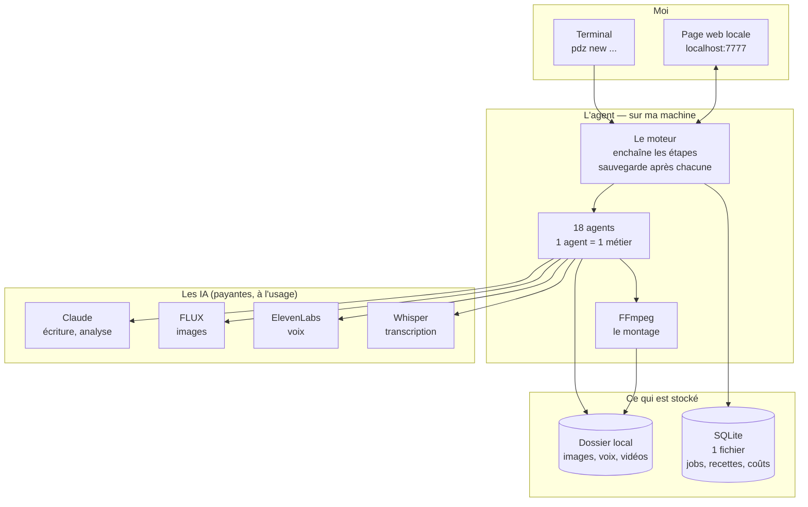
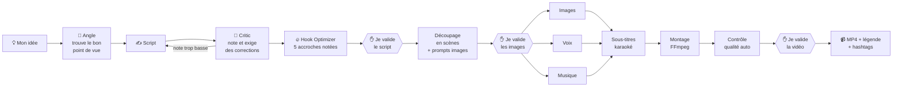
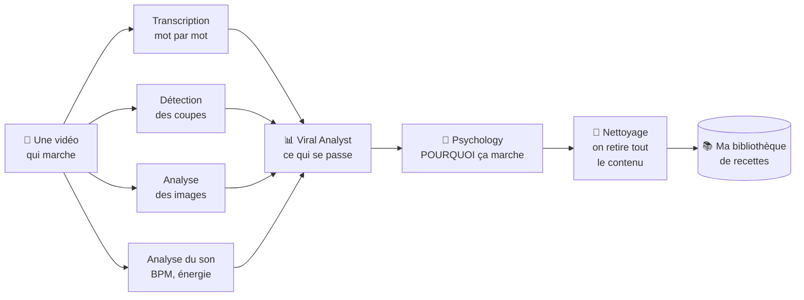
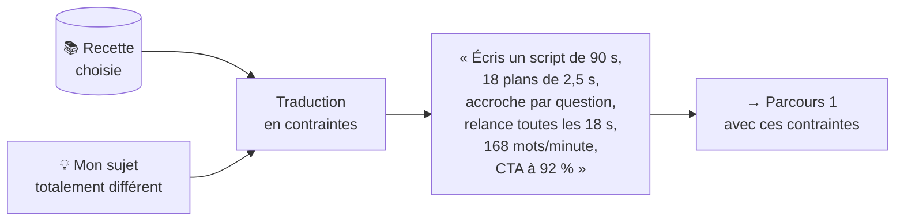

# 01 — Comment ça marche

> ⚠️ **Ce document décrivait une version Python en ligne de commande.**
> Le projet part en réalité de mon workflow n8n existant.
> **Le document à jour est [04 — Ce qu'il faut changer](./04-ce-quil-faut-changer.md).**
> Celui-ci reste utile pour comprendre les 3 parcours du produit.

## Le principe en une phrase

Mon workflow n8n découpe le travail en étapes, appelle Claude et les autres IA pour
chacune, et me demande mon avis aux moments clés avant de me rendre la vidéo.

**Objectif : 120 vidéos par mois, de 1 à 2 minutes, pour moi seul.**

## Le schéma global

Trois choses seulement à retenir :

1. **Tout est sur ma machine.** Pas de serveur, pas de comptes, pas de mots de passe.
   Les seules choses qui sortent, ce sont les appels aux IA.
2. **SQLite = un seul fichier.** `pronotedz.db`. Je peux le copier, le sauvegarder,
   l'ouvrir avec n'importe quel outil. Pas de base de données à installer.
3. **Chaque étape est sauvegardée.** Si ça plante à l'étape 7, ça repart à l'étape 7 —
   pas depuis le début, et sans repayer les 6 premières.

---

## Parcours 1 — Une idée → une vidéo

**Temps** : ~2 min de réflexion IA + ~3 min de montage, plus mon temps de validation.
**Coût** : environ 0,20 € pour une vidéo de 90 secondes.

---

## Parcours 2 — Analyser une vidéo qui marche

Je télécharge une vidéo TikTok qui cartonne, je la donne à l'agent.

**Ce que « la recette » contient concrètement :**

| Ce qu'on mesure | Exemple |
|---|---|
| L'accroche | type « question choc », dure 1,8 s |
| **Les relances** | une nouvelle question toutes les 18 s ← **le plus important sur 90 s** |
| Le rythme | 18 plans, 2,5 s en moyenne, 24 coupes/minute |
| La narration | 168 mots/minute, ton confiant, pauses courtes |
| La structure | accroche → tension → révélation → appel à l'action |
| L'émotion | curiosité au début, surprise à 60 %, satisfaction à la fin |
| Le visuel | plans serrés, texte au centre, 3 mots par carte |
| L'appel à l'action | à 92 % de la vidéo, formulation impérative courte |
| 🧠 **Les mécanismes psychologiques** | manque d'info ouvert à 0,8 s et refermé à 71 % ; aversion à la perte comme moteur ; signal d'appartenance à 12 s ← **c'est ça qui se transpose vraiment à un autre sujet** |

**Important** : la recette ne contient **aucune phrase, aucun nom, aucune image** de la
vidéo d'origine. Juste des chiffres et des catégories. Un squelette.
C'est ce qui fait la différence entre s'inspirer et copier — et c'est pour ça que
l'étape « nettoyage » n'est pas contournable.

**Coût** : environ 0,08 € par vidéo analysée.

---

## Parcours 3 — Appliquer une recette à mon sujet

C'est là que se trouve la vraie valeur du truc : la **forme** vient d'une vidéo qui a
fait ses preuves, le **fond** est entièrement à moi.

---

## Les 3 moments où l'agent me demande mon avis

Il s'arrête, m'envoie une notification, et attend. Je peux valider, corriger, ou tout jeter.

| Quand | Ce que je vois | Ce que je peux faire |
|---|---|---|
| **Après le script** | l'angle, 3 accroches au choix, le texte scène par scène — **par lot de 10** | valider · réécrire · relancer · annuler |
| **Après le découpage** | les descriptions d'images, un aperçu, un extrait de la voix | *auto à 120 vidéos/mois, sauf alerte qualité* |
| **Après le montage** | la vidéo finie + la légende et les hashtags — **par lot** | valider · refaire le montage · corriger les sous-titres |

Si je ne réponds pas, **il attend**. Il n'annule rien, il ne publie rien tout seul.
Je retrouve le travail en attente le lendemain avec `pdz list`.

---

## Ce que j'ai supprimé par rapport à la première version

Parce que c'est pour moi tout seul, tout ça devient inutile :

| Supprimé | Pourquoi |
|---|---|
| Comptes, mots de passe, inscription | il n'y a que moi |
| Facturation, abonnements, crédits, Stripe | je paie les IA directement |
| Séparation entre clients, sécurité multi-utilisateurs | il n'y a qu'un seul utilisateur |
| PostgreSQL, Redis, serveurs, Docker Compose à 8 services | SQLite + un dossier suffisent |
| Grafana, Prometheus, Loki, Sentry | un fichier de log et `pdz cost` suffisent |
| Le tableau de bord web complet | une page locale pour valider suffit |
| Le stockage cloud | mon disque dur |

**Ce que j'ai gardé** : les agents, la recette virale, la reprise après plantage, le
cache, le versionnement des prompts, la possibilité de changer de modèle IA facilement.
Ce sont les parties qui servent vraiment, même à une seule personne.
