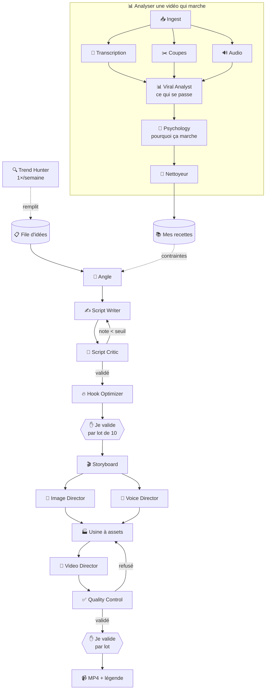

# 02 — Les agents

## Ta liste vs la mienne

Ta liste est celle d'un **studio** : chaque poste créatif a son spécialiste.
La mienne était celle d'un **technicien** : j'avais la plomberie, il me manquait la
profondeur créative.

Les deux sont justes. Je fusionne : **18 agents**.

| Ton agent | Verdict | Détail |
|---|---|---|
| 🔍 **Trend Hunter** | ✅ gardé, mais **recadré** | Excellent — mais aucune source fiable de « tendances » n'existe gratuitement. Je le transforme en **générateur d'idées** hebdomadaire. Voir plus bas ⚠️ |
| 📊 **Viral Analyst** | ✅ gardé, **éclaté en 5** | Analyser une vidéo, c'est 5 métiers différents dont 3 qui ne coûtent rien |
| 🧠 **Psychology Agent** | ✅✅ **ta meilleure idée** | Il me manquait. C'est lui qui rend une recette transférable à un autre sujet |
| ✍️ **Script Writer** | ✅ gardé | |
| 🧐 **Script Critic** | ✅✅ **excellent** | Améliore vraiment la qualité. +0,03 €/vidéo très bien dépensés |
| 🔥 **Hook Optimizer** | ✅✅ **excellent** | Les 3 premières secondes décident de 80 % du résultat. Mérite son agent dédié |
| 🎬 **Storyboard Agent** | ✅ gardé | |
| 🎨 **Image Director** | ✅ gardé, séparé du storyboard | Découper le temps ≠ tenir un style visuel sur 12 images |
| 🎤 **Voice Director** | ✅ gardé, mais **minuscule** | Bonne idée, mais c'est 3 décisions. Un appel Haiku à 0,002 € |
| 🎥 **Video Director** | ✅ gardé | |
| ✅ **Quality Control** | ✅✅ **bien vu de le séparer** | Un agent ne doit jamais valider son propre travail |

**Ce que j'ajoute à ta liste** (la plomberie, sans quoi rien ne marche) :
Ingest, Transcription, Détection de coupes, Analyse audio, Angle, **Nettoyeur d'ADN**,
Usine à assets.

---

## Les 18 agents, dans l'ordre

### 🔍 Veille — tourne 1×/semaine, pas à chaque vidéo

| # | Agent | Ce qu'il fait | Coût |
|---|---|---|---|
| **1** | 🔍 **Trend Hunter** | Remplit ma file d'idées pour la semaine | ~0,10 €/semaine |

⚠️ **À lire avant de s'emballer sur celui-là.**

Il n'existe **aucune API fiable et gratuite** qui dit « voilà ce qui est tendance sur
TikTok ». Le TikTok Creative Center existe, mais ce n'est pas une API officielle : le
récupérer est fragile et hors CGU.

Ce qu'il utilise vraiment — tout est légal et gratuit :

| Source | Ce qu'elle donne |
|---|---|
| **Reddit** (API officielle) | les vraies questions que se posent les gens dans ma niche — **la meilleure source d'idées** |
| **Google Trends** | ce qui monte en recherche cette semaine |
| **YouTube Trending** (API officielle) | formats qui marchent, quota gratuit |
| **Mes propres vidéos** | ce qui a marché chez moi, quand j'aurai des stats |
| **Ma saisie manuelle** | les 5 vidéos qui m'ont marqué cette semaine |

Et surtout, soyons lucides : **une tendance TikTok dure 3 à 10 jours.** Le temps de
générer et de publier, elle est souvent finie. Son vrai boulot n'est pas de prédire la
viralité, c'est de **m'éviter la page blanche** le dimanche soir quand je dois trouver
30 idées. C'est déjà beaucoup, mais ce n'est pas de la voyance.

### 📊 Analyse d'une vidéo qui marche

| # | Agent | Ce qu'il fait | Avec quoi | Coût |
|---|---|---|---|---|
| **2** | 📥 **Ingest** | Récupère et normalise la vidéo | FFmpeg | **0 €** |
| **3** | 📝 **Transcription** | Tout ce qui est dit, timing de chaque mot | Whisper | 0,001 € |
| **4** | ✂️ **Détecteur de coupes** | Chaque coupe, durée de chaque plan | PySceneDetect | **0 €** |
| **5** | 🔊 **Analyste audio** | BPM, énergie, silences, volume | librosa | **0 €** |
| **6** | 📊 **Viral Analyst** | Regarde les images clés, puis **fusionne tout** en fiche structurée | Haiku vision + Sonnet | 0,049 € |
| **7** | 🧠 **Psychology Agent** | **Pourquoi** ça marche | Sonnet | 0,022 € |

> Les agents 4 et 5 sont **gratuits**. Le rythme de montage et le BPM se **mesurent**
> avec des outils classiques. Envoyer ça à une IA coûterait 100× plus cher pour un
> résultat moins précis.

### 🧠 Zoom sur le Psychology Agent — ta meilleure idée

C'est la pièce qui me manquait, et elle est au cœur du produit.

Le Viral Analyst dit **ce qui se passe** :
> « 18 plans, 2,5 s en moyenne, accroche de 1,8 s, CTA à 92 % »

Le Psychology Agent dit **pourquoi ça marche** :
> « Manque d'information ouvert à 0,8 s et refermé seulement à 71 % → le cerveau ne peut
> pas lâcher. Signal d'appartenance à 12 s (“si tu fais de la muscu depuis 2 ans”) → le
> spectateur se reconnaît et reste. Rupture de motif à 34 s. Moteur principal :
> l'aversion à la perte (“tu perds tes gains”), pas l'envie de gagner. »

**Pourquoi c'est la différence entre un gadget et un vrai outil :**

Les chiffres du Viral Analyst ne se transposent qu'à moitié. « 18 plans de 2,5 s »
appliqué à un autre sujet donne une vidéo au bon rythme mais **vide**.

Les mécanismes psychologiques, eux, se transposent **entièrement**. « Ouvre une question
sans réponse dans la première seconde, ne la referme qu'aux trois quarts, utilise la peur
de perdre plutôt que l'envie de gagner » — ça marche sur la muscu comme sur la cuisine
ou la finance.

Ce qu'il repère :

| Mécanisme | Exemple concret |
|---|---|
| **Manque d'information** | « Le truc que personne ne te dit… » |
| **Boucle ouverte** | on annonce une révélation, on la donne 40 s plus tard |
| **Aversion à la perte** | « tu perds tes gains » > « tu gagnes du muscle » |
| **Rupture de motif** | changement brutal de ton, de plan ou de rythme |
| **Signal d'appartenance** | « les gens qui… » → le spectateur se reconnaît |
| **Effet de précision** | « 3 erreurs » marche mieux que « des erreurs » |
| **Contre-pied** | dire l'inverse de ce que tout le monde répète |
| **Preuve sociale / autorité** | « après 400 clients… » |
| **Récit de transformation** | avant → obstacle → après |

Sortie : quels mécanismes, **à quel moment**, avec quelle intensité.
C'est ça qui part dans ma bibliothèque de recettes.

### 🧬 La recette

| # | Agent | Ce qu'il fait | Coût |
|---|---|---|---|
| **8** | 🧬 **Nettoyeur d'ADN** | Retire **tout** le contenu identifiable : phrases, noms, marques, visuels | 0,009 € |

**Non négociable.** Sans lui, ma bibliothèque contient le travail des autres.
Avec lui, elle ne contient que des structures et des mécanismes — ce qui ne se protège
pas, et ce qui est réellement réutilisable.

### ✍️ Écriture — le cœur

| # | Agent | Ce qu'il fait | Modèle | Coût |
|---|---|---|---|---|
| **9** | 🎯 **Angle** | Mon idée brute → un point de vue précis, une promesse, une cible | Haiku | 0,003 € |
| **10** | ✍️ **Script Writer** | Le texte scène par scène, sous les contraintes de la recette | Sonnet | 0,045 € |
| **11** | 🧐 **Script Critic** | Note le script, exige des corrections précises | Sonnet | 0,030 € |
| **12** | 🔥 **Hook Optimizer** | Ne travaille **que** les 3 premières secondes | Sonnet | 0,011 € |

### 🧐 Zoom sur le Script Critic — comment éviter qu'il serve à rien

Le piège classique : une IA qui critique son propre texte répond « très bon script ! ».
C'est un phénomène connu — la complaisance — et ça rend la boucle inutile.

Trois règles pour que ça marche vraiment :

**1. Il note sur une grille, il ne discute pas.**

```
Accroche          6/10  ⚠️  « Aujourd'hui je vais vous parler de » — formule morte
Densité           8/10  ✓
Clarté            9/10  ✓
Rythme            5/10  ⚠️  scènes 7 à 11 : 4 phrases explicatives d'affilée, ça traîne
Relances          4/10  ❌  aucune relance entre 30 s et 70 s → décrochage garanti
Chute             7/10  ✓
Originalité       5/10  ⚠️  angle déjà vu — 3 vidéos similaires dans mon historique
                  ─────
                  TOTAL 44/60 → seuil 48 → RÉÉCRITURE DEMANDÉE

Corrections exigées :
  1. Supprimer l'introduction, commencer directement par la scène 2
  2. Insérer une relance à 42 s (question ou retournement)
  3. Fusionner les scènes 8, 9 et 10
```

**2. Ce n'est pas le même cerveau que l'auteur.**
Modèle différent, ou au minimum température différente et prompt qui ne partage rien
avec celui de l'écriture. Sinon il valide ses propres réflexes.

**3. Une seule réécriture, jamais deux.**
Écriture → critique → réécriture → **on livre**. Pas de boucle infinie : au troisième
tour, l'IA peaufine des détails et dégrade l'ensemble. Et ça coûte cher.

Coût réel : ~0,030 €/vidéo, soit **3,60 €/mois** pour 120 vidéos.
C'est le meilleur rapport qualité/prix de tout le système.

### 🔥 Zoom sur le Hook Optimizer

Il ne voit **que** les 3 premières secondes. Pas le reste. C'est volontaire : un agent
qui voit tout se met à optimiser tout.

Il produit **5 accroches concurrentes**, typées et notées :

```
1. QUESTION    « Pourquoi tu stagnes depuis 6 mois ? »              7/10
2. NÉGATION    « Arrête les pompes. Sérieusement. »                 9/10  ★
3. CHIFFRE     « 3 erreurs. La 2e te coûte 1 an. »                  8/10
4. POV         « POV : tu t'entraînes dur pour rien »               6/10
5. CONTRE-PIED « Les abdos, ça ne se fait pas à la salle »          8/10
```

Je choisis, ou je laisse la meilleure note. Et **plus tard** — quand j'aurai de vraies
statistiques de rétention — je pourrai vérifier si ses notes correspondent à la réalité,
et corriger son prompt en conséquence. C'est l'agent qui a le plus de potentiel
d'amélioration dans le temps.

### 🎨 Direction artistique

| # | Agent | Ce qu'il fait | Coût |
|---|---|---|---|
| **13** | 🎬 **Storyboard** | Découpe le script en **18 plans** avec leur durée exacte, calée sur la voix | 0,010 € |
| **14** | 🎨 **Image Director** | Décide **12 images** pour 18 plans, tient le style, écrit les prompts | 0,008 € |
| **15** | 🎤 **Voice Director** | Ton, vitesse, pauses, mots à accentuer — d'après la recette | 0,002 € |

**Pourquoi séparer 13 et 14** (tu avais raison) : découper le temps et tenir une cohérence
visuelle sur 12 images, ce sont deux métiers. L'Image Director gère la palette, le style,
la graine aléatoire commune, et décide **quels plans réutilisent une image** (recadrage,
zoom inversé), lesquels prennent du b-roll gratuit, lesquels sont des cartes de texte.
C'est lui qui fait tenir le budget images **et** la cohérence du rendu.

**Voice Director** : tout petit mais utile. La recette dit « 168 mots/minute, ton confiant,
pauses courtes » → il traduit ça en réglages concrets pour la synthèse vocale.
0,002 €, autant le faire.

### 🎬 Fabrication

| # | Agent | Ce qu'il fait | Coût |
|---|---|---|---|
| **16** | 🏭 **Usine à assets** | Exécute : images, voix, musique, sous-titres. **Aucune décision, aucun raisonnement IA** | images + voix |
| **17** | 🎥 **Video Director** | Assemble : zoom lent, coupes sur le rythme, transitions, mixage | **0 €** (FFmpeg) |
| **18** | ✅ **Quality Control** | Vérifie et **peut refuser** | 0,009 € |

### ✅ Zoom sur le Quality Control

Tu as eu raison de le séparer du Video Director. Un agent ne valide jamais son propre
travail — c'est vrai pour les humains comme pour les IA.

Il a **le droit de bloquer**, et à 120 vidéos/mois c'est indispensable :

| Il vérifie | Il refuse si |
|---|---|
| Durée | hors de 60–120 s |
| Son | silence > 2 s, volume hors norme |
| Images | image noire, doublon exact, image manquante |
| Sous-titres | décalage > 300 ms avec la voix |
| Lisibilité | texte sous les boutons TikTok |
| Rythme | un plan qui dure > 8 s |
| Cohérence | une scène sans visuel |
| Sens *(vision)* | l'image du plan 7 correspond-elle à ce qui est dit ? |

Une vidéo refusée **ne m'est jamais montrée** : elle repart en correction automatique,
ou elle est mise de côté avec la raison écrite. C'est ce qui m'évite de perdre du temps
sur des ratés évidents quand j'en valide 30 d'un coup.

---

## Le parcours complet



Les deux boucles de correction (Critic → Writer, QC → Usine) sont **limitées à un tour**.
Sans cette limite, une vidéo peut boucler et coûter cher.

---

## Ce que ça coûte

| | Avant (12 agents) | **Maintenant (18)** | Différence |
|---|---|---|---|
| Par vidéo générée | 0,148 € | **0,195 €** | +0,047 € |
| 120 vidéos/mois | 17,76 € | **23,40 €** | +5,64 € |
| Analyse d'une vidéo | 0,059 € | **0,081 €** | +0,022 € |
| 20 analyses/mois | 1,18 € | **1,62 €** | +0,44 € |
| Trend Hunter | — | **0,40 €** | +0,40 € |
| ElevenLabs + sauvegarde | 24,00 € | **24,00 €** | — |
| **TOTAL MENSUEL** | 42,94 € | **49,42 €** | **+6,48 €** |
| **Marge sur 80 €** | 37 € | **30,58 €** | |

**+6,50 €/mois pour un Script Critic, un Hook Optimizer, un Psychology Agent et un
Quality Control indépendant.** C'est très largement rentable : ce sont exactement les
agents qui améliorent la qualité, et la qualité est le seul risque réel du projet.

---

## Ce que chaque agent déclare

Rien ne change dans la mécanique — un fichier de config par agent :

```yaml
id: script_critic
description: "Note le script et exige des corrections précises"

modele: claude-sonnet-4-5
modele_different_de: script_writer   # ← anti-complaisance
temperature: 0.2                     # ← sévère, pas créatif
cout_max: 0.05

prompt: ecriture/critique@1.0.0
sortie: schemas/critique.json        # notes chiffrées, pas de prose

seuil_validation: 48                 # /60
reecritures_max: 1                   # ← jamais de boucle infinie

cache: oui
sauvegarde: oui
```

Le reste — réessais, cache, comptage des coûts, logs — est géré par le moteur.

**Ajouter un agent** = 1 fichier de config + 1 prompt + ~30 lignes de code.
Ta liste a été intégrée sans toucher au moteur : c'était exactement le but de
l'architecture.

---

## Ce qui reste le vrai risque

Aucun de ces 18 agents ne garantit qu'une vidéo sera regardable. Un script noté 55/60
par le Critic peut donner une vidéo plate si le montage ne suit pas.

C'est pour ça que l'étape 0 du plan reste **fabriquer 5 vidéos de 90 s à la main**
avant d'écrire une ligne de code. Les agents automatisent un savoir-faire — ils ne le
créent pas.
