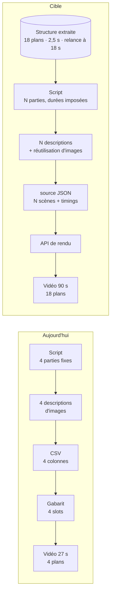

# 03 — Le template n8n : ce qu'on en garde

> **Contexte** : ce document analyse le template n8n de référence (agent conversationnel →
> Perplexity → Generate Script → Generate Image Descr → Generate .csv → rendu).
> **Ce template ne sera pas utilisé tel quel** — le projet est construit en Python, sans
> n8n ni outil de rendu par gabarit. Mais il contient de bonnes idées à reprendre, et
> une erreur de conception importante à ne pas répéter.

---

## 3.1 Ce qu'on garde du template

| Bonne idée | Pourquoi on la reprend |
|---|---|
| **Structure de prompt constante**<br/>ACTION / ÉTAPES / PERSONA / CONTEXTE / CONTRAINTES / MODÈLE | Excellente discipline. Reprise telle quelle pour les 18 agents |
| **« Ne jamais reformuler l'idée de l'utilisateur »** | Contrainte très juste : l'agent d'interface transmet, il n'interprète pas |
| **Recherche Perplexity optionnelle** | Bonne idée, pas chère. Gardée comme étape facultative |
| **Séparation script / descriptions d'images / assemblage** | C'est le bon découpage. Conservé |
| **Descriptions d'images en anglais** | Les modèles d'images sont meilleurs en anglais |
| **« 1 ou 2 éléments visuels max »** | Évite les images IA chargées et illisibles |
| **Validation humaine du script** | C'est le bon endroit pour la première validation |

---

## 3b.2 Le mur : 4 parties fixes

Et maintenant le problème de fond. Il est sérieux, mais il est identifié tôt.

**Ton workflow produit toujours la même forme de vidéo.** Or le produit décrit dans le
brief consiste précisément à **reproduire une forme extraite d'une autre vidéo**.

Faisons le calcul de ce que produit la chaîne actuelle :

```
4 parties × 18 mots max        = 72 mots maximum
72 mots à ~160 mots/minute     ≈ 27 secondes
4 images fixes                 = 4 plans
                               ≈ 6,8 s par plan
                               ≈ 9 coupes par minute
```

Et voici ce que mesure typiquement l'analyse d'une vidéo TikTok performante de 90 s
(section 1, niveau 1 — ce sont des mesures, pas des estimations) :

| | Ton gabarit actuel | Une vidéo analysée typique |
|---|---|---|
| Durée | ~27 s | 60–120 s |
| Nombre de plans | **4** | **15–25** |
| Durée moyenne d'un plan | 6,8 s | 2,5 s |
| Coupes par minute | 9 | 24 |
| Relances narratives | 0 | 3 à 5 |

**Conclusion sans détour** : une structure extraite d'une vraie vidéo TikTok
**ne peut pas être exécutée** par le gabarit à 4 slots. Tu peux extraire l'ADN, tu ne
peux pas l'appliquer. Le produit s'arrête au milieu.

C'est le point le plus important de ce document.

---

## 3b.3 Le changement clé : passer du CSV au JSON dynamique

Bonne nouvelle : **ce n'est pas une réécriture, c'est un changement de mode d'appel.**

Les outils de rendu par gabarit ont tous deux modes :

| Mode | Comment | Limite |
|---|---|---|
| **Bulk CSV** *(ton mode actuel)* | Les colonnes correspondent aux éléments du gabarit | **Nombre de scènes figé** par le gabarit |
| **API + source JSON** | Tu envoies la composition complète : N scènes, leurs durées, transitions, animations | **Aucune limite de nombre de scènes** |

En mode API, ce n'est plus l'outil qui impose la forme — c'est toi. Le nombre de scènes,
leur durée exacte, les transitions, l'animation du texte : tout devient piloté par la
structure extraite.



**Les prompts existants restent valables à ~80 %.** Ce qui change dans `Generate Script` :

```diff
  ### CONTRAINTES :
- - Chaque partie du script ne doit pas dépasser 18 mots.
- - Le script doit être divisé en 4 parties.
+ - Le script doit être divisé en {{ structure.nb_parties }} parties.
+ - Partie {{ i }} : exactement {{ structure.mots[i] }} mots (±2), pour tenir
+   {{ structure.duree_ms[i] }} ms à {{ structure.debit_wpm }} mots/minute.
+ - Placer une relance narrative aux positions : {{ structure.relances }}.
  - Le ton doit être accrocheur et percutant.
```

Le nombre de mots par partie n'est plus une règle arbitraire : il est **calculé à partir
de la durée du plan mesurée et du débit narratif mesuré**. C'est exactement l'application
du principe de la section 1 — le LLM ne devine jamais un chiffre qu'un outil sait calculer.

---

## 3b.4 Cinq corrections à faire tout de suite

Indépendamment du produit final, ce sont des bugs latents dans la chaîne actuelle.

### ⚠️ 1. L'indexation par position est fragile — le plus urgent

```
{{ $json.data[6].Valeur }}   ← le compte TikTok
{{ $json.data[8].Valeur }}   ← l'audience cible
{{ $json.data[0].Valeur }}   ← le ton
```

Si quelqu'un insère ou réordonne une ligne dans la source de config, **tous les prompts
reçoivent silencieusement les mauvaises valeurs**. Pas d'erreur, pas d'alerte : juste des
scripts qui deviennent bizarres sans raison apparente. C'est le genre de bug qui coûte
une demi-journée.

À remplacer par une recherche par clé :
```
{{ $json.config.compte_tiktok }}
{{ $json.config.audience_cible }}
```
Un seul Code node en amont transforme le tableau en objet clé/valeur.

**Incohérence déjà présente** : `Generate Script` lit le compte en `data[6]`, alors que
`Generate Image Descr` le lit en `data[5]`. Soit ce sont deux agrégats différents — et il
faut le documenter —, soit l'un des deux est faux dès maintenant. À vérifier en priorité.

### ⚠️ 2. Ne fais pas générer le CSV par un LLM

C'est la correction qui rapporte le plus.

Le prompt `Generate .csv` demande à un modèle d'assembler des données. Trois problèmes :

- **Fiabilité** : les voiceovers contiennent des virgules, des apostrophes, des guillemets.
  L'échappement CSV correct (`"` doublés, champs entre guillemets) est produit correctement
  la plupart du temps par un LLM — mais pas toujours. Le jour où ça casse, tu obtiens un
  rendu corrompu sans message d'erreur clair.
- **Coût** : c'est un appel LLM payé pour du collage de chaînes.
- **Latence** : quelques secondes ajoutées pour rien.

**C'est un Code node.** Assembler 8 valeurs déjà connues dans un format tabulaire est une
opération déterministe. Gratuite, instantanée, correcte à 100 %, toujours.

> Règle générale, et elle vaut pour tout le système : **un LLM ne doit jamais faire ce
> qu'une fonction sait faire.** C'est la même règle qu'en section 1 (ne pas faire estimer
> un BPM par un modèle), appliquée à la mise en forme de données.

### 3. Deux étapes numérotées « 4 » dans le prompt SYSTEM

Les étapes sont : 1, 2, 3, **4**, **4**, 5, 6, 7. Le modèle peut hésiter sur l'ordre entre
« transmettre l'idée » et « recevoir le script ». À renuméroter.

### 4. Aucune gestion d'erreur

Que se passe-t-il si `Gen Script` renvoie 3 parties au lieu de 4 ? Si Perplexity ne
répond pas ? Si le rendu échoue ?

Aujourd'hui, la chaîne s'arrête sans que personne ne le sache. Il faut, au minimum :
- une validation de la sortie de chaque étape (compter les parties, vérifier les champs) ;
- un **Error Workflow global** branché sur tous les workflows ;
- la table `dead_letters` et le workflow de reprise de la [section 3](./03-n8n.md#34-les-7-workflows-et-pas-17).

### 5. Aucun suivi du coût

Aucune trace de ce que coûte une vidéo. À 50 utilisateurs, c'est le premier chiffre dont
tu auras besoin pour fixer ton prix. La table `usage_events` de la
[section 3.7](./03-n8n.md#37-appeler-claude-depuis-n8n--3-points-concrets) se branche en
20 minutes et se remplit toute seule.

---

## 3b.5 Ce que je garde de ton workflow

| Élément | Décision |
|---|---|
| Agent conversationnel comme interface | ✅ gardé — mais il devient l'UI Lovable pour le SaaS |
| Recherche Perplexity optionnelle | ✅ gardée — bonne idée, et pas chère |
| Structure ACTION/ÉTAPES/PERSONA/CONTEXTE/CONTRAINTES/MODÈLE | ✅ **gardée telle quelle** pour tous les prompts |
| « Ne jamais reformuler l'idée de l'utilisateur » | ✅ excellente contrainte, conservée |
| Séparation script / descriptions d'images / assemblage | ✅ gardée, c'est le bon découpage |
| Validation humaine du script | ✅ gardée, c'est le gate n°1 |
| Descriptions d'images en anglais | ✅ gardé — les modèles d'images sont meilleurs en anglais |
| « 1 ou 2 éléments visuels max » | ✅ gardé — évite les images IA chargées et illisibles |
| **4 parties fixes** | ❌ **remplacé par N variable piloté par la structure** |
| **18 mots par partie** | ❌ **remplacé par un nombre de mots calculé par plan** |
| **Génération du CSV par LLM** | ❌ **remplacé par un Code node** |
| **Bulk CSV** | ❌ **remplacé par l'API + source JSON** |
| Indexation `data[N]` | ❌ remplacée par un accès par clé |

---

## 3b.6 Ce que ça change dans le plan

**Ce workflow devient le « mode simple » du produit**, et c'est une vraie fonctionnalité :

- **Mode simple** — idée → vidéo, 4 parties, structure par défaut. Ça marche **aujourd'hui**.
  Utilisable pour les premiers utilisateurs payants, pendant que le reste se construit.
- **Mode structure** — analyse d'une vidéo → application de sa forme. C'est le produit
  différenciant, et il a besoin du passage au JSON dynamique.

Concrètement, ça raccourcit le chemin vers les premiers revenus : tu n'as pas besoin
d'attendre que tout le pipeline d'analyse soit prêt pour vendre quelque chose.

**Le premier vrai chantier technique** n'est donc pas l'analyse vidéo — c'est le passage
du gabarit à 4 slots à une composition à N scènes. Tant que ce point n'est pas levé,
l'extraction d'ADN produit une donnée que rien ne sait exécuter.

> **À vérifier cette semaine, avant tout le reste** : ton outil de rendu accepte-t-il
> une composition JSON à N scènes via son API, avec durées et transitions par scène ?
> - **Oui** → le chemin est ouvert, c'est une évolution de workflow.
> - **Non** → il faut changer d'outil de rendu, et ça se décide maintenant, pas dans
>   deux mois. C'est traité en [section 6](./06-rendu.md).
