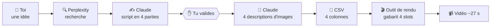
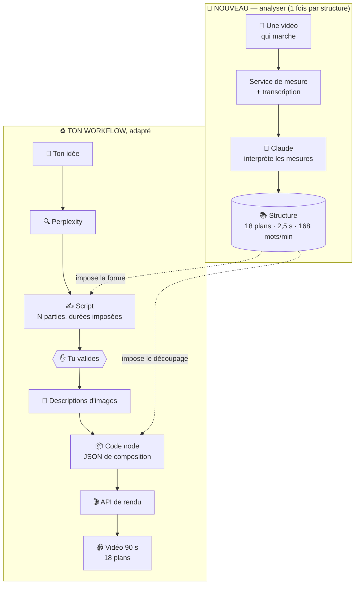

# 04 — Ce qu'il faut changer dans ton n8n

> Tu as déjà un système qui tourne. Ce document ne repart pas de zéro :
> il liste **ce qu'il faut ajouter** pour passer de « vidéo à partir d'une idée »
> à « vidéo qui copie la structure d'une autre vidéo ».

## 4.1 Ce que tu as aujourd'hui



Ça marche. C'est déjà beaucoup.

## 4.2 Ce qu'il faut ajouter — trois briques, pas plus

| | Brique | Effort | Débloque quoi |
|---|---|---|---|
| **A** | Nombre de plans libre | 2–3 jours | **LE blocage.** Sans ça, rien d'autre ne sert |
| **B** | Mesurer une vidéo | 2–3 jours | Récupérer la structure d'une vidéo qui marche |
| **C** | Brancher les mesures dans les prompts | 1–2 jours | Appliquer cette structure à ton sujet |

**Total : environ 2 semaines.** Pas 6.

---

## 4.3 Brique A — Débloquer le nombre de plans

### Le problème en une image

```
Aujourd'hui : gabarit à 4 cases fixes → toujours 4 plans, ~27 s
Il te faut  : autant de plans que la structure l'exige → 12, 18, 22…
```

### La solution

Ton outil de rendu a deux entrées possibles :

| | Ce que tu envoies | Nombre de plans |
|---|---|---|
| **Bulk CSV** *(actuel)* | un tableau qui remplit un gabarit | figé |
| **API** | la composition complète en JSON | **libre** |

En mode API, tu n'envoies plus « voici 4 textes », tu envoies « voici 18 scènes, avec
leurs durées, leurs images, leurs transitions ». C'est l'outil qui s'adapte à toi.

### Comment tester sans rien casser

**Ne remplace pas ton workflow. Duplique-le.**

1. Copie ton workflow → `Génération v2`.
2. Remplace le nœud `Generate .csv` par un nœud **Code** qui construit le JSON.
3. Remplace l'envoi du CSV par un nœud **HTTP Request** vers l'API de rendu.
4. **Mets 8 plans en dur**, pas 4. Pas encore d'analyse, juste 8.
5. Lance. Regarde la vidéo.

✅ **Si tu obtiens une vidéo à 8 plans → le blocage est levé, tout le reste suit.**
❌ Si l'outil refuse → il faut en changer, et c'est mieux de le savoir maintenant.

> **À vérifier avant de commencer** : ton outil de rendu accepte-t-il une composition
> JSON par API ? Creatomate, JSON2Video et Shotstack le font tous. Si tu utilises autre
> chose, cherche « API » dans sa documentation.

---

## 4.4 Brique B — Mesurer une vidéo

C'est le seul morceau que ta stack ne sait pas faire, et le seul truc à installer.

### Ce qui se fait avec une simple API (facile, direct dans n8n)

| Mesure | Outil | Coût |
|---|---|---|
| **Transcription + timing de chaque mot** | Groq Whisper, AssemblyAI ou Deepgram — un nœud HTTP dans n8n | ~0,001 €/vidéo |

### Ce qui demande un petit service (le seul vrai chantier)

| Mesure | Pourquoi il n'y a pas d'API |
|---|---|
| **Où sont les coupes** (donc le nombre et la durée des plans) | Aucun service ne vend ça. C'est `PySceneDetect` |
| **Énergie du son, BPM, silences** | C'est `librosa` |
| **Durée, format, images/seconde** | C'est `ffprobe` |

C'est **un petit programme Python, environ 150 lignes**. Tu envoies l'URL d'une vidéo,
il te renvoie un JSON avec toutes les mesures. Claude Code peut l'écrire pour toi.

### Où le faire tourner — du plus simple au plus contrôlable

| Solution | Pour qui | Coût |
|---|---|---|
| **Modal** *(recommandé)* | Python pur, une commande pour déployer, te donne une adresse web à appeler depuis n8n | ~30 $ de crédit gratuit/mois, largement suffisant |
| **Hugging Face Spaces** | gratuit, mais un peu plus lent au démarrage | 0 € |
| **Un petit serveur Hetzner** | si tu veux tout maîtriser | ~5 €/mois |

Dans les trois cas, depuis n8n c'est **un simple nœud HTTP Request**. Le service est
une boîte noire : tu lui donnes une vidéo, il te rend des chiffres.

### Ce qu'il te renvoie

```json
{
  "duree_s": 92,
  "nb_plans": 18,
  "duree_moyenne_plan_s": 2.5,
  "coupes_par_minute": 24,
  "debit_mots_par_minute": 168,
  "bpm_musique": 128,
  "plans": [
    { "debut_s": 0,    "fin_s": 1.8 },
    { "debut_s": 1.8,  "fin_s": 4.1 },
    { "debut_s": 4.1,  "fin_s": 6.9 }
  ],
  "courbe_energie": [0.4, 0.7, 0.9, 0.6, 1.0]
}
```

**Tout ça est mesuré, pas deviné.** Fiable à 90–96 % (voir [02 — Faisabilité](./02-faisabilite.md)).

---

## 4.5 Brique C — Brancher les mesures dans tes prompts

Bonne nouvelle : **tes prompts restent bons à 80 %.** Seules les contraintes changent.

### Dans `Generate Script`

```diff
  ### CONTRAINTES :
- - Chaque partie du script ne doit pas dépasser 18 mots.
- - Le script doit être divisé en 4 parties.
+ - Le script doit être divisé en {{ nb_plans }} parties.
+ - Partie N : exactement {{ mots_par_plan[N] }} mots (±2).
+   Ce nombre est calculé pour tenir la durée du plan à {{ debit_wpm }} mots/minute.
+ - Placer une relance narrative (question, retournement) aux positions {{ relances }}.
  - Le ton doit être accrocheur et percutant.
```

Le nombre de mots par partie n'est plus une règle arbitraire : il vient d'un calcul.

```
durée du plan 3 = 2,8 s
débit mesuré    = 168 mots/minute
                  ─────────────────
                  → 2,8 × 168 / 60 ≈ 8 mots pour la partie 3
```

### Dans `Generate Image Descr`

```diff
- - Une seule image par partie du script (soit 4 descriptions au total).
+ - {{ nb_images }} descriptions pour {{ nb_plans }} plans.
+ - Certains plans réutilisent une image précédente avec un cadrage différent :
+   la liste des réutilisations est fournie.
  - Simples : 1 ou 2 éléments visuels max.
```

**Pourquoi moins d'images que de plans** : pour 18 plans, 12 images suffisent. Un même
visuel, zoomé sur deux zones différentes, fait deux plans distincts à l'œil. C'est moins
cher **et** plus cohérent visuellement. Détail dans [07 — Budget](./07-budget.md).

### À la place de `Generate .csv`

Un nœud **Code** (pas un appel à Claude) qui assemble le JSON de composition.
C'est du collage de données : déterministe, gratuit, jamais faux.

---

## 4.6 Le système une fois terminé



Tu remarqueras que **la partie basse, c'est ton workflow actuel**. Les nœuds sont les
mêmes, seules les contraintes changent. La partie haute est nouvelle, et elle ne tourne
que quand tu analyses une vidéo — pas à chaque génération.

---

## 4.7 Par quoi commencer

| Ordre | Quoi | Durée | Pourquoi dans cet ordre |
|---|---|---|---|
| **0** | Les 3 corrections rapides *(voir [03](./03-mon-systeme-actuel.md#3b4-cinq-corrections-à-faire-tout-de-suite))* | 2 h | Ça ne débloque rien, mais ça t'évite des heures de recherche de bug plus tard |
| **1** | **Brique A** — 8 plans en dur, sans analyse | 2–3 j | **Si ça ne marche pas, tout le reste est inutile.** À faire en premier, toujours |
| **2** | **Brique B** — le service de mesure | 2–3 j | Tu peux analyser une vidéo et voir les chiffres |
| **3** | **Brique C** — brancher les deux | 1–2 j | Le produit complet |
| **4** | Réglages | continu | Hook, critique du script, qualité |

> **La règle** : ne construis jamais la brique B avant d'avoir prouvé la brique A.
> Mesurer une vidéo pour obtenir « 18 plans » n'a aucun intérêt si ton rendu ne sait
> faire que 4 plans. C'est l'erreur la plus coûteuse possible sur ce projet.

---

## 4.8 Ce que ça coûte

Pour **toi seul**, ~120 vidéos/mois de 90 secondes :

| Poste | €/mois |
|---|---|
| n8n Cloud Starter | ~24 € *(120 vidéos ≈ 480 exécutions, ça rentre largement)* |
| Ton outil de rendu | **à vérifier — le poste que je ne connais pas** |
| Claude (scripts, analyses) | ~12 € |
| Images (FLUX) | ~9 € |
| Voix (ElevenLabs Creator) | 22 € |
| Service de mesure (Modal) | 0 € *(crédit gratuit)* |
| Transcription (Groq) | < 1 € |
| **Sous-total connu** | **~68 €** |

**Le seul chiffre qui manque, c'est ton outil de rendu.** Selon le plan, ça peut aller de
0 € (si tu es dans un forfait déjà payé) à 40–60 €/mois. C'est ce qui décidera si tu
tiens dans les 80 € ou s'il faut viser 120 €.

---

## En résumé

> **Tu as déjà 70 % du système.**
> Il manque : le nombre de plans libre, un petit service de mesure, et trois
> modifications de prompts.
>
> **Deux semaines de travail, et la première chose à tester tient en une journée.**
