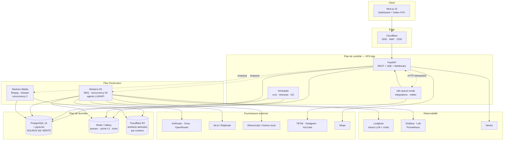
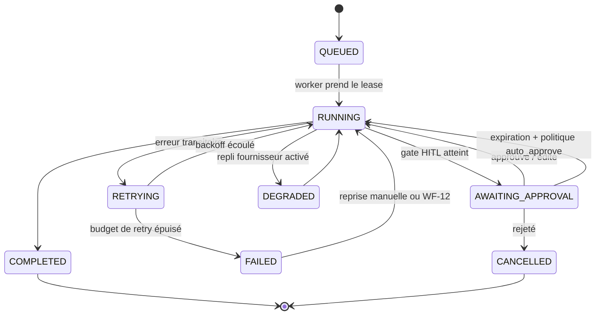
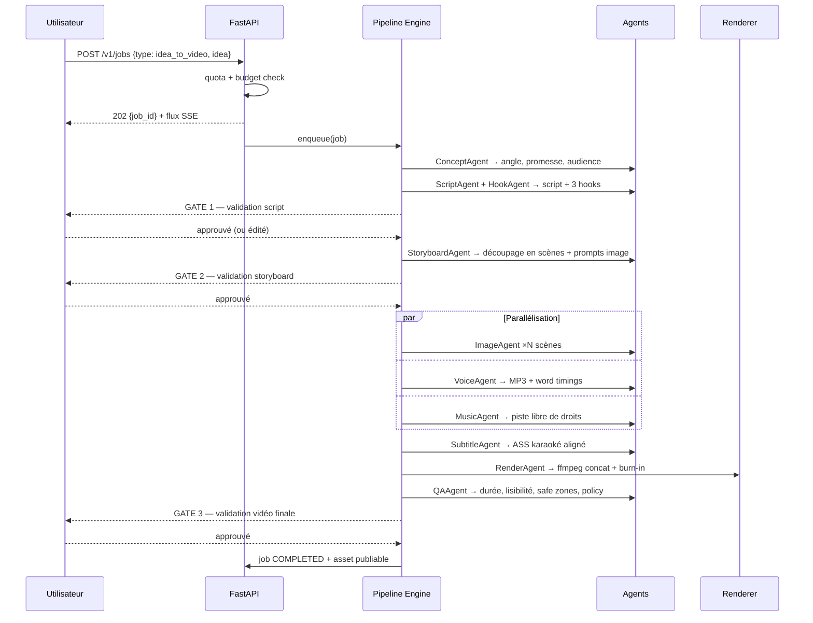
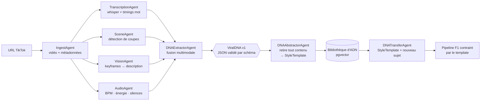
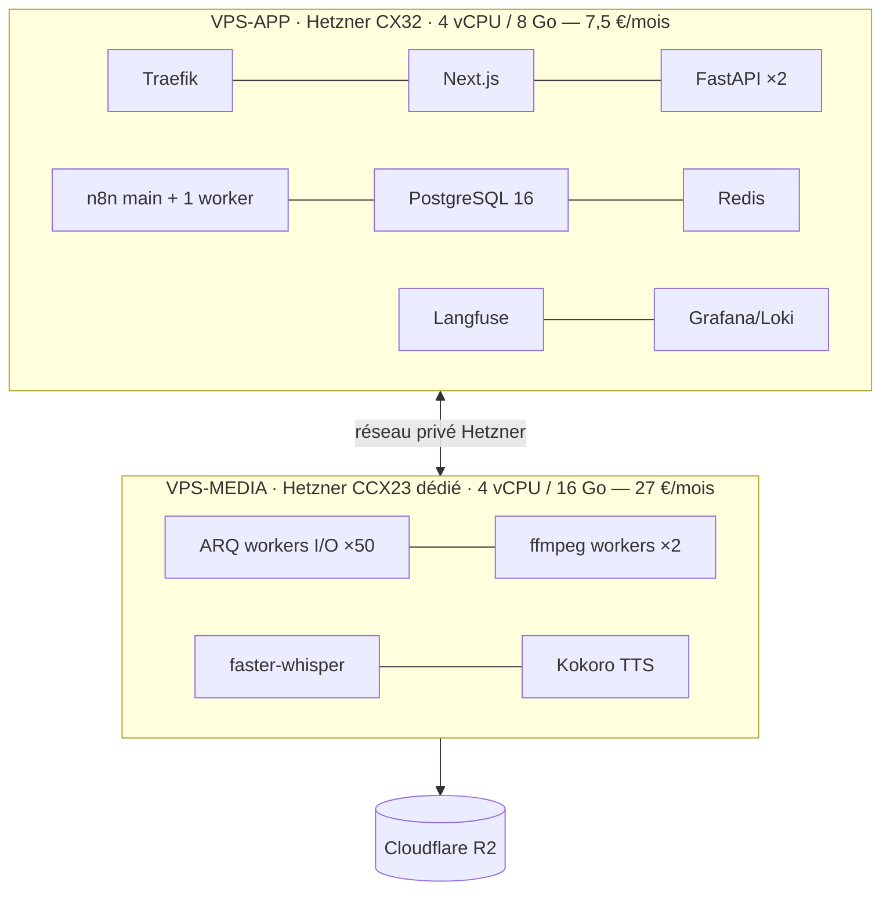

# 01 — Architecture globale

## 1. Vue d'ensemble (C4 niveau 2 — conteneurs)

## 2. Les cinq plans et leurs frontières

| Plan | Responsabilité | Ne fait jamais |
|---|---|---|
| **Présentation** (`apps/web`) | UI, gates HITL, preview, billing | Aucun appel direct à un fournisseur IA |
| **Contrôle** (`apps/api`) | Auth, quotas, création de jobs, machine à états, webhooks | Aucun traitement long (> 2 s) |
| **Orchestration** (`libs/core/pipeline` + `orchestration/n8n`) | Enchaînement des étapes, gates, reprise | Aucune logique d'agent |
| **Exécution** (`apps/worker`, `apps/renderer`) | Agents, appels modèles, média | Aucune décision produit |
| **Données** (PG / Redis / R2) | Persistance, cache, artefacts | — |

**Règle de dépendance** : les flèches ne remontent jamais.
`web → api → pipeline → agents → adapters → fournisseurs`.
Un agent ne connaît ni FastAPI ni n8n. Un adapter ne connaît pas le domaine.

## 3. Machine à états d'un job

C'est le cœur du système : elle porte la reprise, les gates et l'observabilité.

Chaque transition écrit une ligne dans `job_events` (append-only) : l'historique complet
d'un job est rejouable, ce qui rend le debug post-mortem possible sans logs.

## 4. Pipeline « idée → vidéo » (F1)

## 5. Pipeline « ADN viral » (F2 → F4)

**Point clé** : `DNAAbstractorAgent` est une étape séparée et obligatoire. Elle supprime
noms propres, phrases, marques, visuels identifiables. Ce qui entre dans la bibliothèque
réutilisable est un **squelette**, jamais un contenu. C'est la traduction technique du
principe P5 et la mitigation du risque juridique R2.

## 6. Modèle de déploiement v1 (budget 80 €)

Le rendu et la transcription sont sur un **CPU dédié** (CCX) et non partagé : ffmpeg sur
vCPU mutualisé produit des temps de rendu erratiques qui cassent le SLO p95.

**Chemin de montée en charge**, sans changement d'architecture :
1. Ajouter des VPS-MEDIA (les workers sont sans état, ils tirent de Redis) → scaling horizontal linéaire.
2. Sortir PostgreSQL sur une instance managée quand le budget le permet.
3. Passer le rendu sur des instances *spot* GPU/CPU à la demande.
4. Remplacer le pipeline engine par Temporal si la durabilité devient critique ([ADR-002](./adr/002-orchestration.md)).

## 7. Multi-tenant

- Isolation **logique** : `org_id` sur chaque table, appliqué par Row-Level Security PostgreSQL — pas seulement par le code applicatif (défense en profondeur).
- Isolation **des files** : clé de file `queue:{tier}` — un compte gratuit qui lance 200 jobs ne bloque pas un compte payant.
- **Fair scheduling** : token bucket par `org_id` en amont de la file, pour éviter la famine.
- Isolation **des artefacts** : préfixe R2 `org/{org_id}/...` + URLs signées à durée courte.
