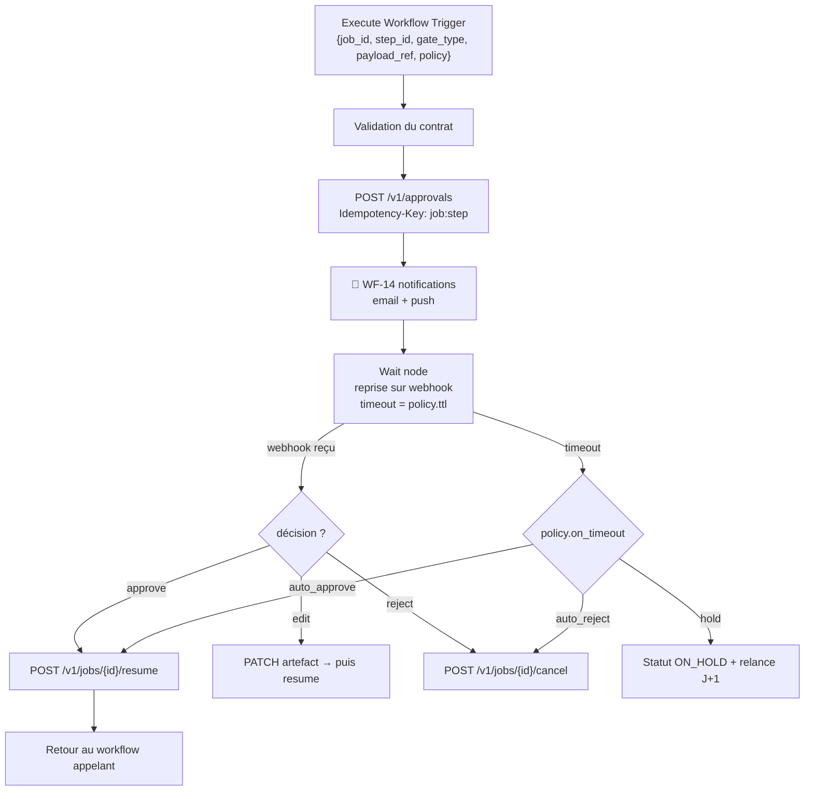

# 04 — Workflows n8n

## 1. La règle de frontière (à lire avant tout le reste)

Tu as demandé des workflows n8n indépendants. Voici l'écart que je propose, et pourquoi.

**Ce que n8n fait très bien** : connecter des systèmes tiers, itérer vite sur de la
logique métier, rendre un processus lisible et modifiable sans déploiement, gérer des
webhooks et des schedules.

**Ce que n8n fait mal à l'échelle « milliers d'utilisateurs »** :
- Un workflow long (5–15 min avec attente humaine) occupe une exécution ; les
  exécutions actives sont coûteuses en mémoire et en lignes `execution_entity`.
- La reprise fine (« reprendre à l'étape 7 avec les artefacts déjà produits ») n'existe
  pas nativement — n8n rejoue depuis un nœud, sans notion d'artefact adressé par contenu.
- Les tests automatisés d'un JSON de workflow sont très limités ; le typage est faible.
- Le fan-out (générer 8 images en parallèle avec budget et retry par branche) devient
  vite illisible.

**Règle retenue :**

> **n8n orchestre les *frontières* et les processus métier à faible volume.
> Le backend orchestre le *cœur* de la génération, à fort volume.
> n8n ne détient jamais d'état : il appelle l'API et lit l'API.**

Concrètement, chaque nœud n8n qui « fait » quelque chose est un appel HTTP idempotent
vers `apps/api`, avec une `Idempotency-Key` dérivée de `(job_id, step_id, attempt_group)`.
Rejouer un workflow n8n ne duplique donc jamais un traitement.

Voir [ADR-002](./adr/002-orchestration.md) pour l'alternative « tout n8n » et pourquoi elle est écartée.

## 2. Répartition

```mermaid
flowchart LR
    subgraph A["n8n — volume faible, changement fréquent"]
        direction TB
        a1["Publication réseaux sociaux"]
        a2["Notifications & relances HITL"]
        a3["Onboarding, lifecycle, CRM"]
        a4["Récupération d'analytics"]
        a5["Reprise des dead letters (cron)"]
        a6["Garde-fou budget (cron)"]
        a7["Évals de prompts (nightly)"]
        a8["Prototypage de nouveaux pipelines"]
    end
    subgraph B["Backend — volume fort, latence critique"]
        direction TB
        b1["Pipeline idée → vidéo"]
        b2["Pipeline analyse ADN"]
        b3["Pipeline transfert d'ADN"]
        b4["Fan-out images / voix"]
        b5["Rendu"]
    end
    A -->|"HTTP idempotent"| B
    B -->|"webhooks d'événements"| A
```

## 3. Catalogue des 17 workflows

Chacun est **indépendant** : un déclencheur propre, un contrat d'entrée JSON validé,
aucun appel direct à un autre workflow sauf via `Execute Workflow` sur les sous-workflows
réutilisables (marqués 🧩).

| ID | Workflow | Déclencheur | Rôle |
|---|---|---|---|
| **WF-00** | `router` | Webhook `/hooks/pdz` | Point d'entrée unique. Valide la signature HMAC, route par `event_type`, applique la déduplication. |
| **WF-01** | `video-from-idea` | Appel API / UI | Pilote F1 en appelant les étapes backend. Sert aussi de **documentation vivante** du pipeline. |
| **WF-02** | `tiktok-ingest-analyze` | Webhook | Ingestion d'une URL/fichier, déclenche A1–A5, notifie à la fin. |
| **WF-03** | `dna-extraction` | Événement `analysis.completed` | B1 → B2 → B3, écrit dans la bibliothèque d'ADN. |
| **WF-04** | `dna-transfer-generate` | UI « générer avec cet ADN » | B4 puis délègue à WF-01 avec contraintes. |
| **WF-05** | `hitl-gate` 🧩 | Sous-workflow | Crée le gate, notifie (email/push/Slack/Discord), attend, gère l'expiration et la politique de repli. Réutilisé par WF-01/03/04/11. |
| **WF-06** | `publish-multiplatform` | Gate final approuvé | Fan-out par plateforme, respecte les quotas d'API, gère OAuth refresh, retry par plateforme. |
| **WF-07** | `publish-scheduler` | Cron 5 min | Publie les posts planifiés à l'heure optimale par audience. |
| **WF-08** | `analytics-collector` | Cron 6 h | Récupère vues/rétention/likes à J+1, J+3, J+7 ; alimente F3. |
| **WF-09** | `feedback-loop` | Cron quotidien | Corrèle performance ↔ ADN/prompts, propose des ajustements (jamais appliqués automatiquement). |
| **WF-10** | `dead-letter-recovery` | Cron 15 min | Rejoue les jobs en DLQ avec backoff, escalade après N échecs. **C'est le filet de la reprise automatique.** |
| **WF-11** | `job-watchdog` | Cron 5 min | Détecte les jobs bloqués (lease expiré, gate silencieux), les remet en file ou alerte. |
| **WF-12** | `cost-guard` | Cron horaire | Agrège les coûts par org/jour, coupe les comptes hors budget, alerte à 70/90/100 % du budget global. |
| **WF-13** | `prompt-eval-nightly` | Cron 03:00 | Fait tourner les évals sur les prompts `canary`, publie un rapport, bloque la promotion en cas de régression. |
| **WF-14** | `notifications` 🧩 | Sous-workflow | Canal unique de notification (email Resend / push / Discord), respecte les préférences utilisateur. |
| **WF-15** | `billing-sync` | Webhook Stripe | Abonnements, crédits, échecs de paiement, dunning. |
| **WF-16** | `asset-gc` | Cron quotidien | Supprime les artefacts intermédiaires > 7 j, applique les règles de rétention RGPD. |
| **WF-17** | `onboarding-lifecycle` | Événement `user.created` | Séquence d'activation, première vidéo offerte, relances. |

## 4. Conventions n8n obligatoires

Sans ces règles, une instance n8n devient ingérable en trois mois.

1. **Nommage** : `WF-<NN>-<kebab-case>`. Le préfixe numérique est stable à vie.
2. **Un contrat d'entrée par workflow**, validé par un nœud `Code` en tête avec un
   JSON Schema. Un workflow qui reçoit une entrée invalide échoue immédiatement et bruyamment.
3. **Idempotence** : tout nœud HTTP porte `Idempotency-Key`. Tout webhook entrant est
   dédupliqué par `event_id` sur 24 h (Redis `SETNX`).
4. **Zéro secret dans le JSON** — uniquement des références de credentials n8n. Le
   linter CI échoue s'il détecte un motif de clé.
5. **Zéro logique métier dans les Code nodes.** Un Code node fait du mapping et de la
   validation. Si un calcul dépasse 20 lignes, il part dans `apps/api`.
6. **Error Workflow global** branché sur tous les workflows → écrit dans `dead_letters`
   et notifie. Aucun échec silencieux.
7. **Queue mode obligatoire** (`EXECUTIONS_MODE=queue`) avec Redis, dès la v1.
8. **`EXECUTIONS_DATA_PRUNE=true`, rétention 7 jours.** La table `execution_entity`
   est la première cause de saturation disque d'un n8n de production.
9. **Base PostgreSQL n8n séparée** de la base applicative (schéma distinct au minimum).
10. **Export/import automatisé** : `just n8n:export` avant chaque commit ; la CI compare
    l'instance et le dépôt et échoue en cas de dérive.

## 5. Exemple — anatomie de WF-05 `hitl-gate` (le sous-workflow le plus utilisé)

Le `Wait` node de n8n reprenant sur webhook est exactement le bon outil ici : l'exécution
est **désactivée en mémoire** pendant l'attente et reprise sur appel HTTP. C'est le cas
d'usage où n8n bat une implémentation maison — et c'est pour ça qu'on garde n8n.

## 6. Les trois gates de validation humaine

| Gate | Position | L'utilisateur voit | Actions | Repli si timeout 48 h |
|---|---|---|---|---|
| **G1 — Concept & script** | après C3 | angle, hooks candidats, script scène par scène | approuver / éditer / régénérer / rejeter | `hold` |
| **G2 — Storyboard & voix** | après C4 + D2 | prompts image, aperçus, extrait voix | approuver / régénérer une scène / changer de voix | `hold` |
| **G3 — Vidéo finale** | après E1/E2 | MP4 + rapport QA + copy plateforme | approuver / re-render / éditer les sous-titres | `hold` |

Gates configurables par plan : en mode « auto-pilot » (plan supérieur), G1 et G2 passent
en `auto_approve` si le score QA dépasse un seuil. La table `approval_gates` reste
renseignée dans tous les cas — l'audit trail est identique.
