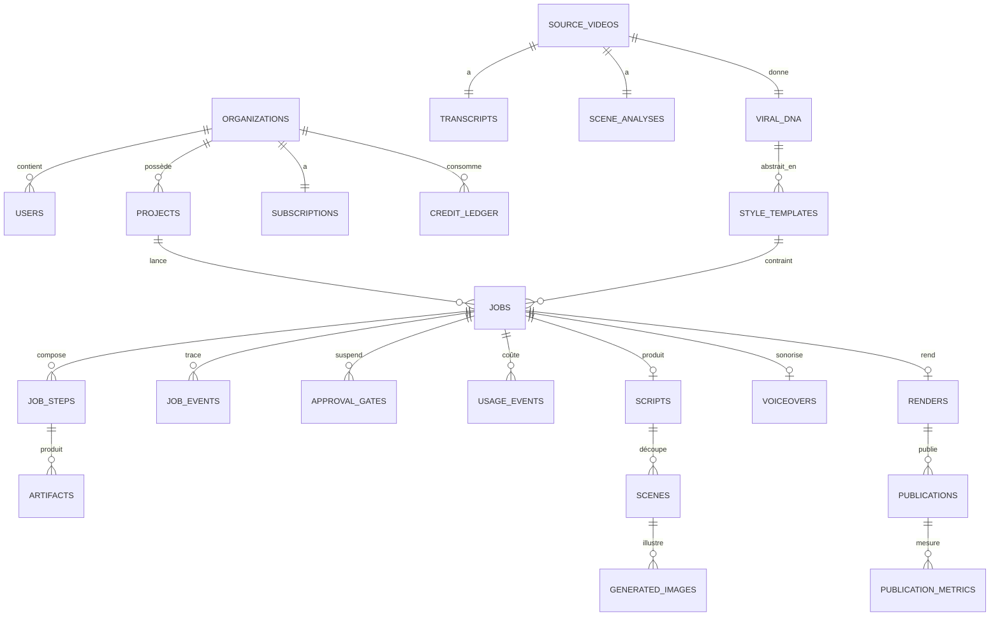
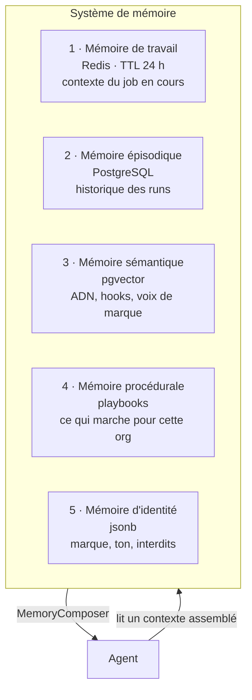

# 05 — Base de données & système de mémoire

## 1. Choix : PostgreSQL 16 seul

Une seule base pour l'OLTP, le vectoriel (`pgvector`), la file d'attente de secours,
le JSON (`jsonb`) et les séries temporelles légères. À l'échelle visée (v1 : quelques
centaines de milliers de lignes/mois), ajouter MongoDB, Pinecone, ClickHouse ou Elastic
ne ferait qu'ajouter des modes de panne et du coût. Chaque brique séparée est identifiée
comme **évolution** dans [13-evolutions.md](./13-evolutions.md), avec son seuil de déclenchement.

Extensions : `pgvector`, `pg_trgm`, `uuid-ossp`, `pgcrypto`, `pg_stat_statements`.

## 2. Schéma (16 groupes de tables)



### Détail par groupe

**1. Tenants** — `organizations`, `users`, `memberships`, `api_keys`
RLS PostgreSQL sur `org_id` pour toutes les tables métier.

**2. Facturation** — `subscriptions`, `plans`, `credit_ledger` (append-only), `usage_events`
`credit_ledger` est un **grand livre immuable** : chaque débit/crédit est une ligne avec
`job_id`, `reason`, `amount`, `balance_after`. Le solde est un `SUM`, pas un compteur
mutable — pas de perte de crédit sur crash concurrent.

**3. Jobs** — `jobs`, `job_steps`, `job_events`, `job_leases`
```
jobs        (id, org_id, project_id, type, status, pipeline_id, pipeline_version,
             input jsonb, style_template_id, budget_eur, spent_eur,
             priority, idempotency_key UNIQUE, created_at, ...)
job_steps   (id, job_id, step_key, agent_id, agent_version, status, attempt,
             input_hash, output_artifact_id, cost_eur, duration_ms,
             started_at, finished_at, error jsonb)
             UNIQUE(job_id, step_key)          ← le socle de la reprise
job_events  (id BIGSERIAL, job_id, seq, type, payload jsonb, at)   ← append-only
job_leases  (job_id PK, worker_id, expires_at)                     ← anti double-exécution
```

**4. Artefacts** — `artifacts`
```
artifacts (id, org_id, content_sha256 UNIQUE, kind, mime, bytes,
           storage_key, meta jsonb, refcount, created_at)
```
Adressage par contenu : deux jobs qui produisent la même image ne stockent qu'un objet.
`refcount` pilote le GC (WF-16).

**5. Analyse source** — `source_videos`, `transcripts`, `scene_analyses`, `visual_analyses`, `audio_features`

**6. ADN** — `viral_dna`, `style_templates`, `dna_embeddings`
```
viral_dna       (id, source_video_id, schema_version, dna jsonb,
                 confidence jsonb, scores jsonb)
style_templates (id, org_id, viral_dna_id, name, template jsonb,
                 embedding vector(1024), is_public, usage_count)
```
La séparation `viral_dna` (lié à une source, privé) / `style_templates` (abstrait,
réutilisable, potentiellement partageable) est la matérialisation du principe P5.

**7. Création** — `scripts`, `script_versions`, `scenes`, `image_prompts`
**8. Assets produits** — `generated_images`, `voiceovers`, `subtitle_tracks`, `music_tracks`, `renders`
**9. HITL** — `approval_gates`
```
approval_gates (id, job_id, step_key, gate_type, status, payload_ref,
                decision, decided_by, decision_note, edits jsonb,
                expires_at, timeout_policy, notified_at, created_at)
```
**10. Distribution** — `social_accounts` (tokens chiffrés `pgcrypto`), `publications`, `publication_metrics`
**11. Prompts** — `prompts`, `prompt_versions`, `prompt_evals`, `prompt_eval_runs`
**12. Modèles** — `model_providers`, `models`, `model_routes`, `model_health`
**13. Mémoire** — `memory_documents` (pgvector), `memory_summaries`, `playbooks`
**14. Cache** — `cache_index` (métadonnées ; les valeurs sont en Redis/R2)
**15. Fiabilité** — `dead_letters`, `outbox_events`, `webhook_inbox`
**16. Audit** — `audit_logs`, `policy_decisions`

### Index critiques

```sql
CREATE INDEX ON jobs (org_id, status, created_at DESC);
CREATE INDEX ON jobs (status, priority DESC) WHERE status IN ('QUEUED','RETRYING');
CREATE UNIQUE INDEX ON job_steps (job_id, step_key);
CREATE INDEX ON job_steps (input_hash) WHERE status = 'COMPLETED';   -- lookup cache
CREATE INDEX ON job_events (job_id, seq);
CREATE UNIQUE INDEX ON artifacts (content_sha256);
CREATE INDEX ON style_templates USING hnsw (embedding vector_cosine_ops);
CREATE INDEX ON memory_documents USING hnsw (embedding vector_cosine_ops);
CREATE INDEX ON approval_gates (status, expires_at) WHERE status = 'PENDING';
```

## 3. Système de mémoire — 5 types

Un « système de mémoire » n'est pas une base vectorielle. C'est cinq besoins distincts
avec cinq durées de vie et cinq stratégies de lecture différentes.



### 1 — Mémoire de travail (Redis, TTL 24 h)
Le contexte partagé du job en cours : sorties des étapes précédentes, décisions du
supervisor, contraintes actives. Clé `job:{id}:ctx`. **Compaction automatique** :
au-delà de 8 000 tokens, les étapes anciennes sont remplacées par un résumé structuré.
Sans compaction, le coût des étapes tardives explose.

### 2 — Mémoire épisodique (PostgreSQL)
`job_events` + `job_steps` = l'historique exact et rejouable. Sert au debug, à la reprise
et à l'analyse post-hoc. Rétention 90 jours en chaud, puis archive Parquet sur R2.

### 3 — Mémoire sémantique (pgvector, `memory_documents`)
Ce qui doit être *retrouvé par similarité* :
- ADN et style templates (« trouve-moi un ADN proche de celui-ci »)
- Bibliothèque de hooks performants (anonymisés, agrégés)
- Voix de marque et exemples validés par l'utilisateur
- Sujets déjà traités → **détection d'auto-plagiat** avant génération

Embeddings : `voyage-3-lite` ou `bge-m3` auto-hébergé (choix arbitré en [ADR-005](./adr/005-embeddings.md)).
Recherche hybride : vectoriel + `pg_trgm` lexical, fusion RRF.

### 4 — Mémoire procédurale (`playbooks`)
Ce que le système a *appris* : « pour la niche finance, les hooks par négation
surperforment de 34 % » ; « ce compte préfère la voix B et les plans < 2 s ».
Alimentée par `FeedbackAgent` (F3) depuis les métriques réelles.

**Garde-fou explicite** : un playbook n'est jamais appliqué automatiquement. Il est
*proposé* dans l'UI, et n'entre en vigueur qu'après acceptation. Un système qui
s'auto-modifie sur des métriques bruitées dérive en quelques semaines — et devient
indébogable.

### 5 — Mémoire d'identité (`organizations.brand_profile jsonb`)
Nom, ton, valeurs, sujets interdits, palette, logo, disclaimers légaux, langue.
Injectée dans **tous** les agents créatifs. C'est le seul contexte jamais compacté.

### `MemoryComposer`
Point d'entrée unique. Un agent ne lit jamais Redis ou pgvector directement : il déclare
ses besoins, le composer assemble un contexte sous budget de tokens.

```yaml
memory_requirements:      # extrait d'un AgentSpec
  identity: required
  working: [concept, script]
  semantic:
    - { collection: hooks, query_from: input.topic, top_k: 5 }
    - { collection: past_topics, query_from: input.topic, top_k: 3, purpose: dedup }
  procedural: { scope: org, tags: [hook_strategy] }
  budget_tokens: 4000
```

Bénéfice : le budget de contexte est **contrôlable et observable** par agent, et la
politique de récupération est de la donnée — donc modifiable sans redéploiement.
