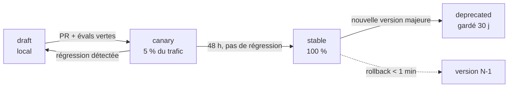

# 06 — Versionnement des prompts & registre de modèles IA

Deux systèmes distincts qui répondent à deux exigences du cahier des charges :
« versionnement des prompts » et « ajouter facilement de nouveaux modèles IA ».

---

## Partie A — Prompt Registry

### A.1 Principe

Un prompt est une **donnée versionnée en git, chargée en base, résolue à l'exécution**.
Ni un f-string dans le code, ni une ligne éditable en base sans trace.

- **Git = source de vérité** (revue, diff, blame, PR).
- **PostgreSQL = index d'exécution** (résolution rapide, canary, rollback à chaud).
- Synchronisation par migration au déploiement ; un prompt en base qui ne correspond
  à aucun fichier git déclenche une alerte.

### A.2 Format

`libs/prompts/catalog/dna/extract_dna@2.1.0.yaml`

```yaml
id: dna/extract_dna
version: 2.1.0                # semver : MAJOR = schéma de sortie cassé
status: stable                # draft | canary | stable | deprecated
owner: "@equipe-ia"

capability: text.reason
recommended_model: tier.reasoning
params: { temperature: 0.3, max_tokens: 4096 }

inputs:                       # contrat strict — rendu échoue si variable manquante
  transcript:      { type: string, required: true, max_tokens: 3000 }
  scene_analysis:  { type: object, required: true }
  audio_features:  { type: object, required: true }

output:
  mode: structured
  schema: schemas/viral_dna_v1.json

messages:
  - role: system
    content: |
      Tu es analyste de contenu court-format...
      RÈGLES:
      1. N'invente jamais une valeur mesurable ; utilise les métriques fournies.
      2. Renseigne `confidence` honnêtement, section par section.
      3. Ne recopie aucune phrase du transcript dans les champs de patron.
  - role: user
    content: |
      TRANSCRIPT: {{ transcript }}
      DÉCOUPAGE: {{ scene_analysis | tojson }}
      AUDIO: {{ audio_features | tojson }}

evals:
  suite: evals/dna_extract/
  min_score: 0.82
  gates: [schema_valid, no_verbatim_copy, confidence_calibration, latency_p95_lt_25s]

changelog: |
  2.1.0 — ajout de `confidence` par section ; +7 pts sur la calibration.
  2.0.0 — BREAKING : ratios au lieu de timecodes absolus.
```

### A.3 Résolution à l'exécution

1. L'`AgentSpec` déclare `prompt_ref: dna/extract_dna@^2.1.0`.
2. **Au démarrage du job**, la version exacte est résolue **une seule fois** et figée
   dans `jobs.pipeline_snapshot`. Un job qui dure 10 minutes ne change jamais de prompt
   en cours de route — sinon la reprise devient incohérente.
3. Le hash du prompt résolu entre dans la clé de cache : publier un prompt invalide
   automatiquement le cache concerné, sans purge manuelle.

### A.4 Cycle de vie



Le rollback est un `UPDATE` sur `prompt_versions.status` — **aucun déploiement**.
C'est le point crucial : en production, un prompt qui dérive doit se corriger en une
minute, pas en un cycle de CI.

### A.5 Évaluations

Chaque prompt porte une suite d'évals (`libs/prompts/evals/<id>/`) mêlant :
- **assertions déterministes** : validité du schéma, longueur, présence de champs, absence de copie verbatim ;
- **juge LLM** sur des critères notés (pertinence, respect du ton, qualité du hook) ;
- **cas de régression** : chaque bug de production devient un cas d'éval permanent.

Exécutées en CI sur les prompts modifiés, et chaque nuit sur l'ensemble (WF-13).
Une régression bloque la promotion `canary → stable`.

### A.6 Ce que ça permet concrètement

| Situation | Action | Temps |
|---|---|---|
| Un prompt produit des scripts trop longs depuis ce matin | rollback en base | < 1 min |
| Tester une nouvelle formulation de hook | publier en `canary` 5 % | 0 déploiement |
| Comprendre pourquoi une vidéo de mars était bonne | `jobs.pipeline_snapshot` donne prompt+modèle exacts | immédiat |
| Prouver la conformité d'un contenu généré | audit trail complet prompt/modèle/entrées | immédiat |

---

## Partie B — Model Registry

### B.1 Principe

**Ajouter un modèle IA = ajouter une entrée YAML. Zéro ligne de code**, tant que le
fournisseur est déjà supporté ou expose une API compatible OpenAI.

Trois niveaux d'abstraction :

```
Agent  →  demande une CAPACITÉ  (text.reason)
          ↓
Registry → résout un ALIAS DE TIER (tier.reasoning) selon des règles
          ↓
Adapter  → parle le protocole du FOURNISSEUR (Anthropic, fal, Groq…)
```

### B.2 `infra/seeds/models.yaml`

```yaml
capabilities: [text.fast, text.reason, text.vision, image.generate,
               audio.tts, audio.stt, embedding.text, video.generate]

providers:
  anthropic:  { adapter: anthropic,   base_url: https://api.anthropic.com,
                secret: ANTHROPIC_API_KEY, rate_limit_rpm: 1000 }
  groq:       { adapter: openai_compat, base_url: https://api.groq.com/openai/v1,
                secret: GROQ_API_KEY }
  fal:        { adapter: fal,          secret: FAL_KEY }
  openrouter: { adapter: openai_compat, base_url: https://openrouter.ai/api/v1,
                secret: OPENROUTER_API_KEY }
  local:      { adapter: openai_compat, base_url: http://media:8080/v1 }

models:
  - id: claude-sonnet-4-5
    provider: anthropic
    capabilities: [text.reason, text.vision]
    context_window: 200000
    cost: { input_eur_per_mtok: 2.8, output_eur_per_mtok: 14.0 }
    features: [structured_output, tool_use, prompt_caching, streaming]
    latency_p50_ms: 3200
    status: active

  - id: claude-haiku-4-5
    provider: anthropic
    capabilities: [text.fast, text.vision]
    cost: { input_eur_per_mtok: 0.9, output_eur_per_mtok: 4.6 }
    features: [structured_output, tool_use, prompt_caching]
    status: active

  - id: whisper-large-v3-turbo
    provider: groq
    capabilities: [audio.stt]
    cost: { eur_per_audio_hour: 0.037 }
    status: active

  - id: flux-schnell
    provider: fal
    capabilities: [image.generate]
    cost: { eur_per_image: 0.0028 }
    features: [seed, aspect_ratio]
    status: active

  - id: kokoro-82m
    provider: local
    capabilities: [audio.tts]
    cost: { eur_per_1k_chars: 0.0 }
    features: [word_timestamps, multi_voice]
    status: active

# ── Les alias : c'est ICI que se pilote toute la stratégie coût/qualité ──
tiers:
  tier.reasoning:
    primary: claude-sonnet-4-5
    fallbacks: [claude-haiku-4-5]
  tier.fast:
    primary: claude-haiku-4-5
    fallbacks: [llama-3.3-70b@groq]
  tier.image_draft:
    primary: flux-schnell
    fallbacks: [sdxl-lightning@fal]
  tier.tts:
    primary: kokoro-82m
    fallbacks: [eleven-turbo-v2-5]

routing_rules:                # évaluées dans l'ordre, première correspondance
  - when: { org.plan: free }
    override: { tier.reasoning: claude-haiku-4-5, tier.image_draft: flux-schnell }
  - when: { org.budget_remaining_pct: "<20" }
    override: { tier.reasoning: claude-haiku-4-5 }
  - when: { model_health.claude-sonnet-4-5: degraded }
    override: { tier.reasoning: claude-haiku-4-5 }
  - when: { job.priority: high, org.plan: pro }
    override: { tier.image_draft: flux-dev }
```

### B.3 Rôle de l'adapter

Un adapter traduit un `ModelRequest` normalisé vers l'API du fournisseur et renvoie une
`ModelResponse` normalisée (contenu, `usage`, coût calculé, latence, `provider_request_id`).
Il gère les particularités : format des sorties structurées, cache de prompt, encodage
des images, pagination des voix. **Il ne contient aucune logique métier.**

Adapters v1 : `anthropic`, `openai_compat` (couvre Groq, OpenRouter, Ollama, vLLM,
DeepSeek, Together…), `fal`, `replicate`, `elevenlabs`, `local_http`.

### B.4 Scénarios d'ajout

| Scénario | Effort |
|---|---|
| Nouveau modèle texte chez Groq | +8 lignes de YAML |
| Nouveau fournisseur compatible OpenAI (DeepSeek, Mistral, Cerebras) | +4 lignes (provider) +8 (modèle) |
| Nouveau modèle image sur fal.ai | +7 lignes de YAML |
| Nouveau fournisseur au protocole propriétaire | +1 adapter (~150 lignes) + YAML |
| Basculer toute la TTS vers un autre fournisseur | 1 ligne (`tiers.tier.tts.primary`) |
| Modèle vidéo (Kling, Veo) quand le budget le permet | +1 capacité `video.generate` + adapter |

### B.5 Santé des modèles & disjoncteur

`model_health` est mis à jour en continu depuis les appels réels : taux d'erreur,
latence p95, taux d'échec de validation de schéma. Trois seuils :
`healthy → degraded` (route vers le repli, alerte) `→ down` (retiré du routage, sondes
périodiques pour la remise en service). Un fournisseur en panne ne bloque jamais la
production ; il dégrade la qualité, visiblement.

### B.6 Comptabilité des coûts

Chaque appel écrit une ligne dans `usage_events` :
`(job_id, step_key, agent_id, model_id, prompt_version, tokens_in, tokens_out, cached_tokens, cost_eur, latency_ms)`.
C'est la source unique pour : le budget guard (temps réel), la facturation en crédits,
les rapports de coût par agent/prompt/modèle, et les décisions d'optimisation.
Sans cette table, on ne sait pas où part l'argent — et à 80 €/mois, c'est éliminatoire.
