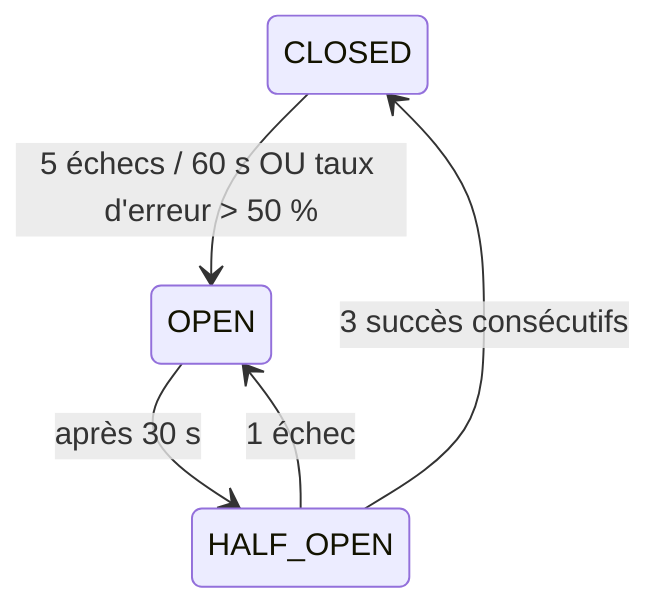
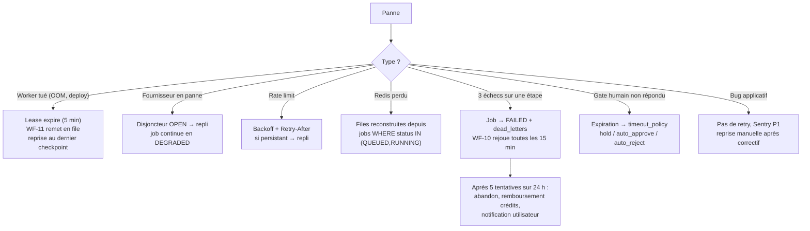

# 07 — Gestion des erreurs & reprise automatique

## 1. Taxonomie des erreurs

Toute erreur est classée dans une des 7 catégories. La catégorie **détermine
automatiquement** la politique de retry, l'alerting et la facturation.

| Catégorie | Exemples | Retry | Facturé ? | Alerte |
|---|---|---|---|---|
| `TRANSIENT` | timeout réseau, 502, connexion coupée | ✅ exponentiel 3× | non | non |
| `RATE_LIMIT` | 429, quota fournisseur | ✅ respect `Retry-After`, puis repli | non | si > 5 %/h |
| `PROVIDER_DEGRADED` | 5xx répétés, latence × 4 | ⚠️ repli immédiat | non | oui |
| `VALIDATION` | sortie hors schéma, JSON invalide | ✅ 2× avec prompt de réparation | oui | si > 10 % |
| `POLICY` | refus du modèle, contenu bloqué | ❌ | non | oui (audit) |
| `BUSINESS` | crédits épuisés, quota du plan, URL invalide | ❌ | non | non |
| `BUG` | `KeyError`, contrat interne violé | ❌ | non | oui, Sentry P1 |

Point important : `VALIDATION` est **facturée** (le modèle a bien consommé des tokens)
mais retentée avec un prompt de réparation qui inclut l'erreur de validation. Environ
80 % des sorties non conformes passent au deuxième essai — c'est nettement moins cher
que de relancer l'étape à zéro.

## 2. Politique de retry

```
délai = min(base × 2^(n-1) × jitter(0.5–1.5), plafond)
base = 2 s · plafond = 120 s · jitter obligatoire (anti thundering herd)
```

Budget de retry **par job**, pas seulement par étape : `max_total_attempts = 3 × nb_étapes`.
Sans ce plafond global, un job pathologique peut boucler et consommer le budget d'une
journée entière — retry par étape seul ne le protège pas.

## 3. Disjoncteur (circuit breaker) par fournisseur



État partagé dans Redis → tous les workers voient le même disjoncteur. En `OPEN`,
le routage bascule immédiatement sur le repli déclaré dans `models.yaml` et le job
est marqué `quality_degraded`.

## 4. Reprise automatique — le mécanisme

C'est le point le plus important de la fiabilité. Il repose sur **trois briques**.

### Brique 1 — Checkpoint par étape

Chaque étape terminée écrit `job_steps(job_id, step_key, status=COMPLETED, output_artifact_id, input_hash)`
avec `UNIQUE(job_id, step_key)`. Reprendre un job = **rejouer le pipeline depuis le
début en sautant toute étape déjà `COMPLETED` avec le même `input_hash`**.

Le moteur ne mémorise donc pas « où il en était » : il *recalcule* ce qui reste à faire.
Cette approche est robuste au crash, au redéploiement et même à un changement de
définition de pipeline entre-temps.

### Brique 2 — Lease anti double-exécution

Avant d'exécuter, un worker prend un lease : `INSERT INTO job_leases … ON CONFLICT DO NOTHING`
avec `expires_at = now() + 5 min`, renouvelé par heartbeat toutes les 60 s. Un worker
tué net libère son lease par expiration ; le watchdog (WF-11) le remet en file.
Deux workers ne peuvent jamais traiter le même job simultanément.

### Brique 3 — Artefacts adressés par contenu

`input_hash = sha256(inputs_canoniques ‖ agent_version ‖ prompt_version ‖ model_id)`.
Si le hash correspond à un artefact existant, l'étape est **résolue sans aucun appel
externe**. C'est le même mécanisme que le cache (voir [08](./08-cache.md)) : reprise et
cache ne sont pas deux systèmes, mais un seul.

### Scénarios couverts



**Redis perdu** mérite une note : les files sont reconstructibles à 100 % depuis
PostgreSQL, puisque `jobs.status` est la vérité. Redis est un accélérateur, jamais une
source de vérité. C'est ce qui rend acceptable un Redis auto-hébergé sans réplication
dans le budget de 80 €.

## 5. Idempotence — trois barrières

1. **À l'entrée API** : `Idempotency-Key` obligatoire sur `POST /v1/jobs`, stockée 24 h.
   Rejouer la requête renvoie le même `job_id`, ne crée pas de second job.
2. **Au niveau étape** : `UNIQUE(job_id, step_key)` + `input_hash`.
3. **Aux effets de bord externes** (publication, débit Stripe) : table `outbox_events`
   avec `delivered_at`. Publier deux fois la même vidéo sur TikTok est irréversible —
   c'est le seul endroit où l'on accepte un « au plus une fois » au prix d'un échec
   possible, plutôt qu'un « au moins une fois ».

## 6. Transactions & saga

Aucune transaction distribuée. Le pattern est **outbox transactionnel** :

```
BEGIN;
  UPDATE job_steps SET status='COMPLETED', output_artifact_id=…;
  INSERT INTO outbox_events (type, payload);      -- publication de l'événement
  INSERT INTO usage_events (…);                   -- comptabilité du coût
COMMIT;
-- un relayeur lit outbox_events et publie vers Redis/n8n, marque delivered_at
```

L'état, le coût et l'événement sont donc **atomiquement cohérents**. Un crash entre le
commit et la publication ne perd rien : le relayeur reprend.

Compensations définies pour les étapes à effet de bord :

| Étape | Compensation |
|---|---|
| Crédits débités puis job échoué | recrédit automatique dans `credit_ledger` |
| Publication partielle (2 réseaux sur 3) | pas de rollback ; état partiel + retry ciblé du réseau manquant |
| Artefacts d'un job abandonné | `refcount--`, GC par WF-16 |

## 7. Dégradation gracieuse

Ordre de dégradation, du moins au plus visible :

1. Modèle de repli au même tier (Sonnet → Haiku).
2. Qualité d'asset réduite (Flux dev → Flux schnell ; ElevenLabs → Kokoro).
3. Nombre de scènes réduit (8 → 5 images, plans plus longs).
4. Suppression des éléments optionnels (musique, SFX, transitions).
5. Livraison partielle : script + assets sans rendu final, avec bouton « relancer le rendu ».

Chaque dégradation est enregistrée dans `job_events` et affichée à l'utilisateur.
**Une dégradation silencieuse est un bug** : l'utilisateur doit savoir qu'il n'a pas
reçu la qualité maximale, sinon il attribue la baisse au produit lui-même.

## 8. Timeouts

| Niveau | Valeur |
|---|---|
| Appel LLM | 60 s (120 s en reasoning) |
| Génération d'image | 90 s |
| TTS | 60 s |
| Transcription | 180 s |
| Rendu ffmpeg | 300 s (kill process group) |
| Étape complète (tous retries) | 10 min |
| Job complet (hors attente humaine) | 45 min |
| Gate humain | 48 h → `timeout_policy` |
| Lease worker | 5 min, heartbeat 60 s |

Le temps d'attente humaine est **exclu** du timeout de job : sinon un utilisateur qui
valide le lendemain matin voit son job annulé — un mode d'échec évitable et très frustrant.
