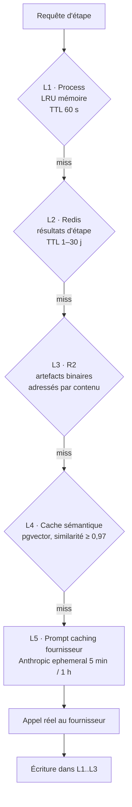

# 08 — Système de cache

## 1. Pourquoi c'est structurant ici

À 80 €/mois de budget total, le cache n'est pas une optimisation : c'est ce qui rend
le modèle économique viable. Trois observations sur le domaine :

- Les utilisateurs **régénèrent beaucoup** (« refais le hook », « change la voix »).
  Sans cache, un re-render à cause d'un sous-titre refacture les 8 images et la voix.
- Un même **StyleTemplate** est appliqué des centaines de fois : les parties du prompt
  qui décrivent le template sont identiques d'un job à l'autre → cache de prompt fournisseur.
- Une même **vidéo TikTok source** est analysée par plusieurs utilisateurs (contenus
  viraux). L'analyse (transcription, scènes, audio) est déduplicable au niveau global.

## 2. Les cinq niveaux



### L1 — Cache process (in-memory)
Prompts résolus, `models.yaml` compilé, JSON Schemas, profils de marque. Évite des
allers-retours Redis/PG sur des données quasi statiques. TTL court + invalidation par
pub/sub Redis pour la cohérence multi-worker.

### L2 — Cache de résultats d'étape (Redis)
La clé est l'`input_hash` défini en [07](./07-fiabilite.md) :

```
input_hash = sha256(
    canonical_json(inputs)      // clés triées, floats arrondis, champs volatils retirés
  ‖ agent_id ‖ agent_version
  ‖ prompt_id ‖ prompt_version
  ‖ model_id
  ‖ params_hash                 // temperature, seed…
)
```

**Normalisation canonique** : sans elle, le taux de hit tombe à ~0 (un espace, un ordre
de clés ou un timestamp suffit à changer le hash). Les champs volatils (`request_id`,
`created_at`) sont explicitement exclus par l'`AgentSpec`.

Portée par type de donnée :
- `global` — analyse d'une vidéo publique (transcription, scènes, BPM) : identique pour tous.
- `org` — scripts, images, voix : jamais partagés entre organisations.
- `job` — contexte de travail.

> **Règle de sécurité non négociable** : la portée est encodée *dans la clé* (`cache:{scope}:{org_id}:{hash}`).
> Une fuite inter-tenant par cache est une classe de bug fréquente et très coûteuse ;
> l'isolation ne doit pas dépendre d'un `if` applicatif.

### L3 — Artefacts adressés par contenu (R2)
Clé = `sha256` du binaire. Deux jobs qui produisent la même image ne stockent qu'un
objet ; `artifacts.refcount` pilote le GC. Bénéfice secondaire : la déduplication du
stockage compte double dans un budget contraint.

### L4 — Cache sémantique (LLM)
Pour les étapes créatives à entrée en langage naturel, une correspondance exacte est
rare. On indexe l'embedding de l'entrée normalisée ; un cosinus ≥ 0,97 rend le résultat
mis en cache.

Appliqué **sélectivement** :

| Agent | Cache sémantique | Raison |
|---|---|---|
| ConceptAgent | ✅ | deux idées proches → même angle acceptable |
| DNAExtractorAgent | ❌ | doit être exact et traçable |
| ScriptAgent | ❌ | la variété est le produit ; servir deux fois le même script est un défaut |
| CopyAgent | ✅ | hashtags/description : redondance sans conséquence |
| StoryboardAgent | ⚠️ seulement pour les prompts de style, pas le contenu | |

C'est le niveau à activer avec prudence : mal réglé, il transforme un générateur créatif
en photocopieuse. Un flag `cache.semantic.enabled` par agent, par défaut à `false`.

### L5 — Prompt caching fournisseur
Les prompts système longs (règles d'ADN, profil de marque, StyleTemplate) sont marqués
`cache_control: ephemeral` chez Anthropic. Ordre imposé dans la construction du message :

```
[ système stable ] [ profil de marque ] [ style template ] ← cachés
[ contexte du job ] [ entrée variable ]                    ← non cachés
```

Sur les agents créatifs, le prompt stable représente ~70 % des tokens d'entrée →
**réduction de ~55 % du coût d'entrée** sur les jobs répétés du même compte.

## 3. Invalidation

Aucune invalidation manuelle : la version fait partie de la clé.

| Événement | Effet |
|---|---|
| Publication d'un prompt v2.1.1 | nouvelles clés ; les anciennes expirent seules |
| Changement de modèle par défaut | idem |
| Modification du profil de marque | bump de `brand_profile_version` inclus dans la clé des agents créatifs |
| Utilisateur clique « régénérer » | `cache_bypass=true` sur cette étape uniquement, en aval inclus |
| Suppression RGPD d'une org | purge par préfixe `cache:org:{org_id}:*` + artefacts à `refcount` 0 |

## 4. TTL

| Donnée | TTL | Justification |
|---|---|---|
| Analyse de vidéo source | 30 j | coûteuse, stable |
| ADN / StyleTemplate | permanent | c'est l'actif |
| Script, prompts image | 7 j | fenêtre d'itération utilisateur |
| Images générées | 30 j | reprises de rendu fréquentes |
| Voix générée | 7 j | souvent changée |
| Rendu final | permanent (R2) | livrable |
| Assets intermédiaires (frames, wav) | 24 h | volumineux, peu réutilisés |
| Sémantique LLM | 24 h | limite la staleness créative |

## 5. Objectifs mesurés

| Métrique | Cible v1 |
|---|---|
| Hit ratio L2 sur re-render | > 85 % |
| Hit ratio L3 (dédup artefacts) | > 30 % |
| Économie via L5 prompt caching | > 40 % du coût d'entrée LLM |
| Coût d'un re-render après édition de sous-titres | < 0,01 € |
| Réduction du coût médian par vidéo | −60 % vs sans cache |

Ces métriques sont exportées en Prometheus (`cache_hits_total{layer,agent}`) et affichées
dans Grafana. Un hit ratio qui s'effondre est le premier symptôme d'une clé de cache mal
normalisée — c'est le genre de régression qui passe inaperçue jusqu'à la facture.
