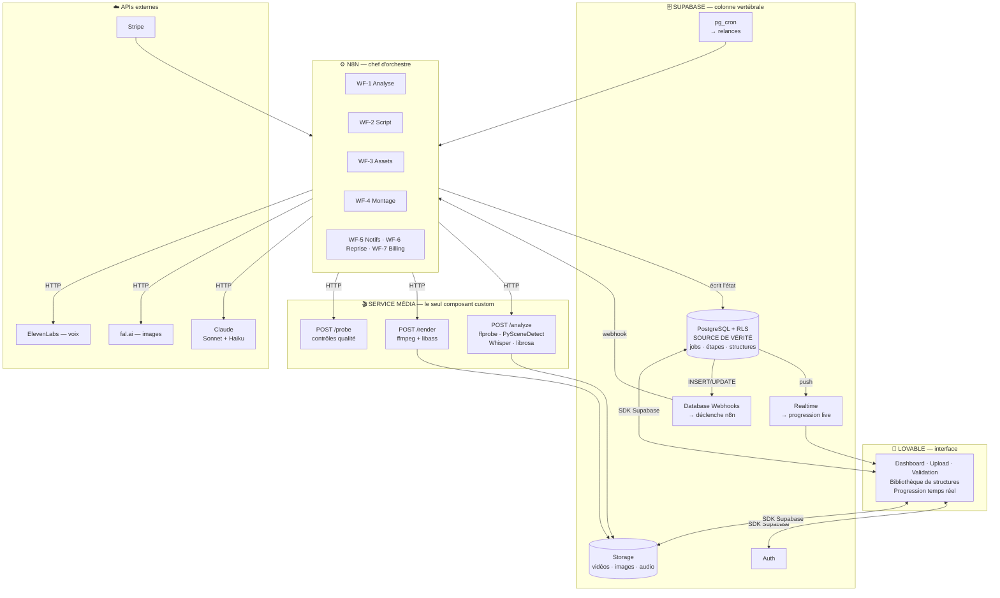
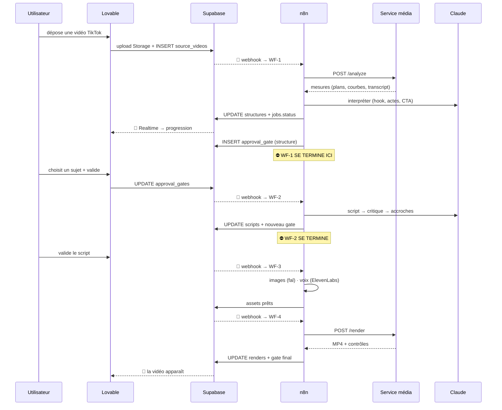

# 2. Architecture globale

**Stack imposée** : Lovable (front) · Supabase (données) · n8n (orchestration) · Claude (IA).

## 2.1 La conclusion d'abord

Ta stack couvre **4 des 5 briques nécessaires**. Il en manque une, et c'est celle qui
fait le produit :

> **Ni Lovable, ni Supabase, ni n8n ne savent analyser une vidéo ni en monter une.**

Pas de `ffmpeg`, pas de détection de plans, pas de `librosa`. Les Edge Functions Supabase
tournent en Deno avec une limite de quelques secondes et pas de binaires système ; n8n
sait appeler des API, pas encoder du H.264.

Il te faut donc **une cinquième brique : un service média**. Un seul composant custom,
2 à 3 endpoints, sur un petit serveur. Tout le reste reste dans ta stack.

C'est la bonne nouvelle : **un seul morceau à construire hors low-code**, pas dix.

## 2.2 Vue d'ensemble

## 2.3 Qui fait quoi — et surtout, qui ne fait pas quoi

| Brique | Responsable de | **Ne fait jamais** |
|---|---|---|
| **Lovable** | Affichage, upload, décisions de validation, réglages | Aucun appel à Claude, fal.ai ou ElevenLabs. Aucune clé d'API dans le navigateur |
| **Supabase** | Auth, état des jobs, structures extraites, fichiers, déclenchement | Aucun traitement long. Les Edge Functions restent des colles de quelques lignes |
| **n8n** | Enchaîner les étapes, appeler les API, écrire les résultats en base | **Ne détient aucun état.** N'attend jamais un humain. Aucune logique métier dans les Code nodes |
| **Service média** | ffprobe, détection de plans, Whisper, librosa, ffmpeg | Aucune décision produit. Il mesure et il encode, c'est tout |
| **Claude** | Interpréter, écrire, critiquer, contrôler | Ne produit jamais un chiffre qu'un outil sait mesurer (règle de la section 1) |

**La règle de dépendance** : les flèches ne remontent pas.
`Lovable → Supabase → n8n → service média / APIs`.
Lovable ne parle jamais directement à n8n ; il écrit en base, et la base déclenche n8n.

## 2.4 La brique manquante — le service média

C'est le seul endroit où tu auras du vrai code. Trois endpoints, rien de plus.

| Endpoint | Entrée | Sortie | Durée |
|---|---|---|---|
| `POST /analyze` | URL Supabase Storage d'une vidéo | JSON : plans, durées, coupes/min, courbe audio, BPM, transcript horodaté, débit, palette, OCR | 20–60 s |
| `POST /render` | Recette de montage (JSON) + URLs des assets | MP4 déposé dans Storage | 2–4 min |
| `POST /probe` | URL d'un MP4 | Contrôles : durée, silences, images noires, sync sous-titres | 5 s |

**Points de conception qui comptent :**

1. **Asynchrone obligatoire.** n8n envoie la demande, reçoit un `202` immédiat, et le
   service rappelle un webhook n8n quand c'est fini. Un `POST /render` synchrone de
   3 minutes fait tomber n8n en timeout et bloque une exécution pour rien.
2. **Une file interne dans le service.** Le rendu est le seul goulot CPU du système.
   Deux rendus en parallèle maximum sur un petit serveur, les autres attendent.
3. **Idempotence par `job_id` + `step`.** Rejouer une demande ne produit pas deux fichiers.
4. **Aucun accès à la base.** Le service reçoit tout ce dont il a besoin dans la requête
   et renvoie tout dans la réponse. C'est n8n qui écrit en base. Ça garde le service
   remplaçable et testable isolément.

> **Où l'héberger** : un VPS Hetzner CPX31 (4 vCPU / 8 Go, ~15 €/mois) fait tourner le
> service média **et** n8n auto-hébergé. C'est aussi ce qui règle le problème de quota
> d'exécutions n8n traité en [section 3](./03-n8n.md).
>
> Alternative sans serveur à gérer : une API de rendu type Creatomate / JSON2Video
> (~40–80 €/mois). Plus cher, mais zéro exploitation. **L'interface reste la même** :
> `POST /render` avec une recette JSON — tu peux basculer plus tard sans rien casser
> ailleurs. Arbitrage chiffré en section 7.

## 2.5 Les 4 canaux de communication

C'est le point le plus important de l'architecture, et le plus simple à rater.

### Canal 1 — Lovable → Supabase (SDK, direct)
L'utilisateur clique. Lovable insère ou met à jour une ligne. C'est tout.
Créer un job = `INSERT INTO jobs (...)`. Valider un script = `UPDATE approval_gates SET decision='approved'`.

### Canal 2 — Supabase → n8n (Database Webhooks)
Une insertion ou une mise à jour déclenche un webhook vers n8n.
**C'est la colle centrale du système.** Lovable ne connaît pas l'existence de n8n, et
n8n ne connaît pas l'existence de Lovable. Ils communiquent par la base.

Bénéfice concret : si n8n est en panne 20 minutes, les jobs s'empilent proprement en base
et repartent au redémarrage. Rien n'est perdu, parce que rien n'a été perdu — l'état
était en base depuis le début.

### Canal 3 — Supabase Realtime → Lovable (progression live)
n8n écrit `job_steps.status = 'completed'` → Supabase pousse le changement au navigateur →
la barre de progression bouge toute seule.

**Gratuit, inclus, et ça remplace tout un système de streaming temps réel.** C'est
l'atout majeur de Supabase pour ce produit : l'utilisateur voit son analyse avancer en
direct sans que tu aies écrit une ligne de plomberie.

### Canal 4 — n8n → tout le reste (HTTP sortant)
Claude, fal.ai, ElevenLabs, le service média. Toujours avec une clé d'idempotence
dérivée de `(job_id, step)`.

## 2.6 Le flux complet, bout en bout

**Remarque essentielle sur ce schéma** : chaque validation humaine **termine un workflow
n8n**. Ce n'est pas une contrainte subie, c'est le bon design — développé en
[section 3](./03-n8n.md#33-ne-jamais-attendre-un-humain-dans-n8n).

## 2.7 Multi-tenant — à faire dès le jour 1

Tu vises 5 000 utilisateurs. Trois choses à câbler tout de suite, parce qu'elles sont
pénibles à rétrofiter :

1. **`org_id` sur chaque table** + **Row Level Security PostgreSQL activée**.
   Lovable interroge Supabase directement depuis le navigateur : sans RLS, n'importe quel
   utilisateur peut lire les données de n'importe qui. Ce n'est pas une optimisation,
   c'est la seule barrière.
2. **Storage cloisonné** : chemin `{org_id}/...` + politiques d'accès Storage.
   URLs signées à durée courte pour les livrables.
3. **n8n utilise la `service_role` key** (il contourne RLS, c'est normal) — donc
   **cette clé ne doit jamais approcher Lovable**. Elle vit uniquement dans les
   credentials n8n.

## 2.8 Ce qui tient à 5 000 utilisateurs, ce qui bougera

| Brique | À 50 users | À 5 000 users | Migration |
|---|---|---|---|
| Lovable | ✅ | ✅ | aucune |
| Supabase | Pro 25 € | Pro/Team + read replicas | changement de plan |
| n8n | 1 instance | queue mode + 2-3 workers | config, pas de réécriture |
| Service média | 1 VPS | 3-5 VPS derrière un load balancer | horizontal, sans état |
| Claude / fal / ElevenLabs | — | plafonds à négocier | aucune |
| **Le rendu vidéo** | 1 VPS | **le vrai mur** | voir section 8 |

**Le seul point qui casse vraiment** est le rendu : 5 000 utilisateurs × 10 vidéos ×
3 minutes de CPU = **2 500 heures de calcul par mois**. C'est le sujet de la section 8,
et c'est là que se joue la marge du SaaS.

Tout le reste passe à l'échelle par ajout de machines ou changement de plan, sans
réécriture — à condition de respecter la règle de la section 3.
