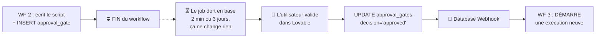

# 3. Ce qui va dans n8n — et ce qui n'y va pas

C'est la section la plus importante pour ta stack. n8n est un excellent outil **mal
utilisé dans 90 % des SaaS qui s'appuient dessus**, et les deux erreurs classiques
coûtent cher : l'une en argent, l'autre en fiabilité.

---

## 3.1 Le piège n°1 : le comptage des exécutions

n8n Cloud facture à l'**exécution de workflow**. Et un appel de sous-workflow
(`Execute Workflow`) compte comme une exécution supplémentaire.

Fais le calcul avant de concevoir, pas après :

```
50 utilisateurs × 10 vidéos/mois = 500 vidéos

Design "bavard"  : 1 workflow par étape, 12 étapes + 4 sous-workflows
                   → 500 × 16 = 8 000 exécutions/mois   ❌ hors forfait Starter

Design "compact" : 4 workflows par vidéo (coupés par les validations)
                   → 500 × 4 = 2 000 exécutions/mois    ✅ tient
```

**Règle : peu d'exécutions, mais grasses.** Un workflow qui fait 6 appels HTTP à la
suite coûte **une** exécution. Six workflows enchaînés en coûtent six, pour le même
travail.

Conséquence directe sur le design : les sous-workflows réutilisables sont une bonne
pratique n8n en général, mais **une mauvaise idée ici**. Duplique 15 lignes de config
plutôt que d'appeler un sous-workflow 500 fois par mois.

### Ma recommandation : auto-héberger n8n dès le départ

Tu as **déjà besoin d'un VPS** pour le service média ([section 2](./02-architecture-globale.md#24-la-brique-manquante--le-service-média)).
Y ajouter n8n coûte ~0 € de plus et supprime définitivement le problème de quota.

| | n8n Cloud Starter | **n8n auto-hébergé** |
|---|---|---|
| Coût | ~24 €/mois | inclus dans le VPS (~15 €) |
| Exécutions | ~2 500/mois | **illimitées** |
| À 5 000 users | impossible | queue mode + workers |
| Effort | zéro | 1 `docker compose`, Claude Code t'aide |
| Sauvegardes | incluses | à toi (base n8n dans Supabase ou dump quotidien) |

⚠️ **Licence** : n8n est en *Sustainable Use License*. L'utiliser comme outil interne
pour faire tourner ton propre SaaS est **autorisé**. Le revendre ou l'exposer comme
fonctionnalité à tes clients ne l'est pas. Ici n8n est invisible de tes utilisateurs →
conforme. À ne pas faire dériver.

⚠️ **Purge obligatoire** : `EXECUTIONS_DATA_PRUNE=true`, rétention 7 jours. La table
`execution_entity` qui gonfle est la première cause de saturation disque d'un n8n de
production. À régler le jour de l'installation, pas le jour de la panne.

---

## 3.2 La règle d'or : n8n ne détient jamais l'état

**Toute la vérité vit dans Supabase.** n8n lit, calcule, écrit, et oublie.

Test simple : si tu tues n8n en plein milieu d'un job, tu dois pouvoir le redémarrer et
reprendre. Ça n'est possible que si chaque étape terminée a été **écrite en base avant
de passer à la suivante**.

Concrètement, dans chaque workflow :

```
[Trigger]
   ↓
[Valider l'entrée]              ← JSON Schema, échec bruyant si invalide
   ↓
[Supabase: UPDATE job_steps status='running']
   ↓
[Appel HTTP — Claude / fal / service média]
   ↓
[Supabase: UPDATE job_steps status='completed' + résultat]   ← ⚠️ AVANT l'étape suivante
   ↓
[Étape suivante...]
```

Cette écriture intermédiaire est ce qui rend la reprise possible. C'est aussi ce qui
alimente Supabase Realtime, donc la barre de progression que voit l'utilisateur. Une
seule discipline, deux bénéfices.

---

## 3.3 Ne jamais attendre un humain dans n8n

n8n a un nœud `Wait` qui sait suspendre une exécution jusqu'à un webhook. C'est
séduisant pour les validations humaines. **Ne l'utilise pas ici.**

| Problème | Conséquence |
|---|---|
| Une exécution en attente reste « active » | elle compte dans tes quotas et ta mémoire |
| L'utilisateur valide 2 jours plus tard | l'exécution vit 48 h pour rien |
| Tu redéploies le workflow entre-temps | l'exécution en attente est perdue ou incohérente |
| 200 validations en attente simultanées | 200 exécutions vivantes |

**Le bon pattern** — et c'est lui qui donne la structure du système :



**Une validation humaine termine un workflow et en démarre un autre.** Le temps
d'attente coûte exactement zéro exécution, zéro mémoire, et survit à un redéploiement.

C'est pour ça qu'il y a 4 workflows de production et pas 1 : **les 3 points de validation
humaine découpent naturellement le pipeline**. La contrainte technique et le bon design
tombent d'accord — c'est généralement bon signe.

---

## 3.4 Les 7 workflows (et pas 17)

Tu es seul. Chaque workflow supplémentaire est une chose à maintenir, déboguer et
versionner. Sept, c'est déjà beaucoup.

| ID | Workflow | Déclencheur | Ce qu'il fait | Exéc./mois* |
|---|---|---|---|---|
| **WF-1** | `analyse-video` | webhook DB · `source_videos` INSERT | service média → Claude (interprétation) → écrit la structure → crée le gate 1 | 500 |
| **WF-2** | `generation-script` | webhook DB · gate 1 approuvé | Claude : script → critique → réécriture → 5 accroches → gate 2 | 500 |
| **WF-3** | `production-assets` | webhook DB · gate 2 approuvé | fal.ai (images en parallèle) + ElevenLabs (voix) + sous-titres | 500 |
| **WF-4** | `montage-controle` | webhook DB · assets prêts | service média `/render` puis `/probe` → Claude QC vision → gate 3 | 500 |
| **WF-5** | `notifications` | webhook DB · gate créé | email (Resend) + push. **Un seul canal pour tout le produit** | ~1 500 |
| **WF-6** | `reprise` | pg_cron toutes les 15 min | détecte les jobs bloqués (> 20 min en `running`), relance ou escalade | ~2 900 |
| **WF-7** | `billing` | webhook Stripe | abonnements, crédits, échecs de paiement | ~200 |

*\*à 50 utilisateurs et 10 vidéos/mois. Total ≈ **6 600 exécutions/mois** — au-dessus
du forfait Starter, d'où la recommandation d'auto-hébergement du 3.1.*

**WF-6 est le filet de sécurité et il n'est pas optionnel.** Sans lui, un job qui plante
au milieu de WF-3 reste bloqué pour toujours : personne ne le relance, l'utilisateur voit
une barre de progression figée, et tu le découvres par un ticket support.

> Astuce coût sur WF-6 : le déclencher via `pg_cron` + `pg_net` depuis Supabase
> **uniquement s'il y a des jobs bloqués** (la requête SQL filtre en amont) plutôt qu'un
> cron n8n toutes les 15 min à vide. Tu passes de 2 900 exécutions à ~50.
> Même logique pour WF-5 : grouper les notifications par lot.

---

## 3.5 Ce qui NE doit jamais être dans n8n

| ❌ À ne pas mettre dans n8n | ✅ Où ça va |
|---|---|
| L'état du job | Supabase |
| L'attente d'une validation humaine | Supabase + Database Webhook |
| Du traitement vidéo ou audio | service média |
| Plus de 20 lignes dans un Code node | service média ou Edge Function |
| Le contenu des prompts Claude | table `prompts` dans Supabase, versionnée |
| Des secrets en dur | credentials n8n uniquement |
| Une boucle sur 500 éléments | découper, ou déléguer au service média |
| La logique de facturation | Stripe + Supabase |

### Le cas des prompts — important

Ne colle pas tes prompts Claude dans les nœuds n8n. Mets-les dans une table Supabase
`prompts (id, version, contenu, statut, modele, temperature)`. n8n les lit au démarrage
du workflow.

Pourquoi ça compte vraiment :
- Un prompt qui dérape se corrige par un `UPDATE`, **sans redéployer un workflow**.
- Tu enregistres la version utilisée dans `job_steps` → tu sais toujours quel prompt a
  produit quelle vidéo. Indispensable quand un utilisateur te dit « c'était mieux avant ».
- Tu peux tester une v2 sur 10 % des jobs sans toucher à n8n.
- Éditer un prompt dans un textarea Lovable est infiniment plus agréable que dans un
  nœud n8n.

C'est 30 minutes de travail au départ et ça te sauvera des dizaines d'heures.

---

## 3.6 Les 8 conventions à tenir

Sans ça, une instance n8n devient ingérable en trois mois — c'est vrai même en solo,
et surtout en solo.

1. **Nommage** `WF-<N>-<nom>`, numéro stable à vie.
2. **Validation de l'entrée** en tête de chaque workflow : un Code node avec un schéma.
   Une entrée invalide échoue immédiatement et bruyamment.
3. **Idempotence** : chaque appel HTTP porte une clé dérivée de `(job_id, step)`.
   Rejouer un workflow ne doit jamais produire deux vidéos ni deux débits Stripe.
4. **Error Workflow global** branché sur les 7 workflows → écrit dans `dead_letters` +
   notifie. **Aucun échec silencieux.**
5. **Timeouts explicites** sur chaque nœud HTTP. Claude : 120 s. fal : 90 s.
   Service média : réponse immédiate `202` (asynchrone).
6. **Retry** : 3 tentatives, backoff exponentiel, uniquement sur les erreurs réseau et
   les 429. Jamais sur une erreur métier — ça ne fait que multiplier le coût.
7. **Export git** : `n8n export:workflow --all` versionné dans ce dépôt. Un workflow
   modifié dans l'UI sans export est un incident en puissance.
8. **`max_tokens` toujours renseigné** sur les appels Claude. Une réponse qui part en
   boucle est le bug le plus cher qui existe sur une API LLM.

---

## 3.7 Appeler Claude depuis n8n — 3 points concrets

**Utilise le nœud HTTP Request, pas le nœud Anthropic intégré.** Tu as besoin de
contrôler trois choses que le nœud générique n'expose pas bien :

**1. Sorties structurées.** Passe un JSON Schema via `tools` + `tool_choice` forcé.
Claude renvoie alors du JSON valide et parsable, au lieu d'un texte à découper à la
regex. Ça change tout sur la fiabilité : ton workflow n8n ne casse plus parce que le
modèle a ajouté une phrase d'introduction.

**2. Prompt caching.** Marque les blocs stables (règles d'analyse, structure de
référence, profil de l'utilisateur) avec `cache_control: ephemeral`, et place-les
**avant** la partie variable. Sur les agents d'écriture, ~60 % de l'entrée est stable →
**économie réelle de l'ordre de 40 % sur le coût d'entrée**. À 500 vidéos/mois, ce n'est
plus un détail.

**3. Comptage du coût.** Chaque réponse Claude contient `usage`. Écris-le dans une table
`usage_events` (job, étape, modèle, tokens entrée/sortie/cachés, coût calculé). C'est la
seule façon de savoir où part ton budget et de facturer correctement. Sans cette table,
tu découvres les problèmes sur ton relevé bancaire.

---

## 3.8 Résumé en une phrase

> **Supabase pense, n8n exécute, le service média calcule, Claude interprète,
> Lovable montre.**

Chaque fois que tu es tenté de mettre de l'intelligence dans n8n, demande-toi si ça ne
devrait pas être une colonne dans Supabase ou un endpoint du service média. Neuf fois
sur dix, la réponse est oui — et le système reste débogable.
